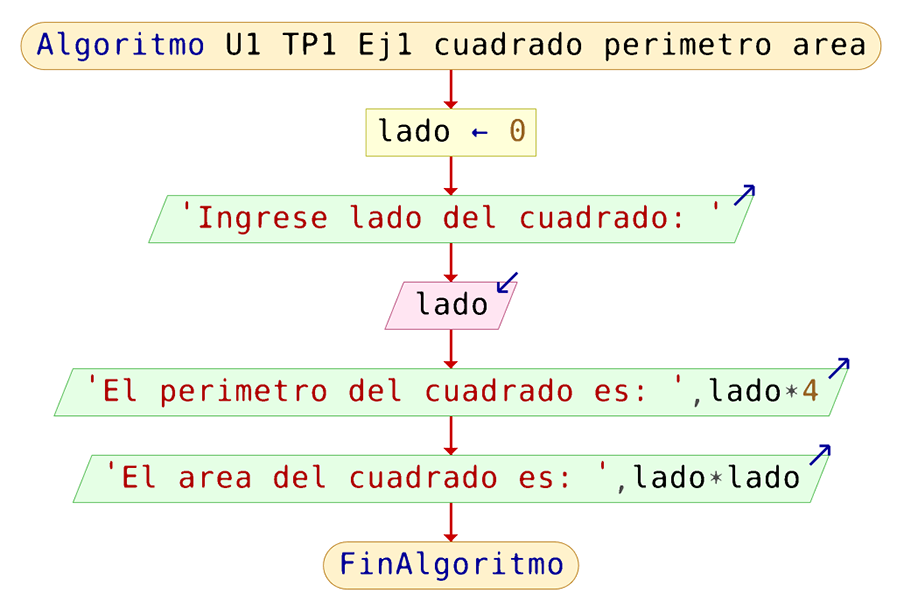

# TP1: Estructura Secuencial
<small>
Created by <i class="fab fa-telegram"></i>
[edme88]("https://t.me/edme88")
</small>

---
## Ejercicio TP1
<!-- .slide: style="font-size: 0.70em" -->
<div class="grid2">
    <div>
        <h3>EJ 1</h3>
        Cuadrado: Perimetro y Área
        <p>
            <a href="#/3"></a>
            <a href="#/4"></a>
            <a href="#/5"></a>
            <a href="#/6"></a>
            <a href="#/7"></a>
        </p>
    </div>
    <div>
        <h3>EJ 2</h3>
        Rectángulo: perímetro y Área
        <p>
            <a href="#/8"></a>
            <a href="#/11"></a>
        </p>
    </div>
    <div>
        <h3>EJ 3</h3>
        Calcular Promedio
        <p>
            <a href="#/13"></a>
            <a href="#/16"></a>
        </p>
    </div>
    <div>
        <h3>EJ 4</h3>
        Traducir DF a Pseudocódigo
        <p>
            <a href="#/18"></a>
        </p>
    </div>
    <div>
        <h3>EJ 5</h3>
        Sueldo Bruto
        <p>
            <a href="#/23"></a>
            <a href="#/26"></a>
            <a href="#/27"></a>
        </p>
    </div>
    <div>
        <h3>EJ 6</h3>
        Suma y Multiplicación
        <p>
            <a href="#/28"></a>
            <a href="#/31"></a>
        </p>
    </div>
    <div>
        <h3>EJ 7</h3>
        Vuelto
        <p>
            <a href="#/33"></a>
            <a href="#/36"></a>
        </p>
    </div>
    <div>
        <h3>EJ 8</h3>
        Segundos que hay en X dias
        <p>
            <a href="#/38"></a>
            <a href="#/41"></a>
        </p>
    </div>
    <div>
        <h3>EJ 9</h3>
        Seg a semanas, dias, hs, min, seg
        <p>
            <a href="#/43"></a>
            <a href="#/46"></a>
        </p>
    </div>
    <div>
        <h3>EJ 10</h3>
        Distancia: Millas a Kilometros
        <p>
            <a href="#/48"></a>
            <a href="#/51"></a>
        </p>
    </div>
    <div>
        <h3>EJ 11</h3>
        Farenheit a Celcius
        <p>
            <a href="#/53"></a>
            <a href="#/56"></a>
        </p>
    </div>
    <div>
        <h3>EJ 12</h3>
        Gasolineria
        <p>
            <a href="#/58"></a>
            <a href="#/61"></a>
        </p>
    </div>
</div>

---
## Ejercicio TP1
<!-- .slide: style="font-size: 0.70em" -->
<div class="grid2">
    <div>
        <h3>EJ 13</h3>
        Sonidos de grillo
        <p>
                    <a href="#/63"></a>
                    <a href="#/66"></a>
                </p>
    </div>
    <div>
        <h3>EJ 14</h3>
        Billetes de Vuelto
        <p>
                    <a href="#/68"></a>
                    <a href="#/71"></a>
                </p>
    </div>
    <div>
        <h3>EJ 15</h3>
        Ángulos: Grados a Radianes
        <p>
            <a href="#/73"></a>
            <a href="#/76"></a>
            <a href="#/77"></a>
        </p>
    </div>
    <div>
        <h3>EJ 16</h3>
        Coordenadas: Cartesianas a Polares
        <p>
            <a href="#/78"></a>
            <a href="#/81"></a>
        </p>
    </div>
    <div>
        <h3>EJ 17</h3>
        Calcular Hipotenusa
        <p>
                    <a href="#/83"></a>
                    <a href="#/86"></a>
                </p>
    </div>
    <div>
        <h3>EJ 18</h3>
        Círculo: Perímetro y Área
        <p>
                    <a href="#/88"></a>
                    <a href="#/91"></a>
                </p>
    </div>
    <div>
        <h3>EJ 19</h3>
        Cilindro: Área y Volumen
        <p>
                    <a href="#/93"></a>
                    <a href="#/96"></a>
                </p>
    </div>
    <div>
        <h3>EJ 20</h3>
        Área del Triángulo
        <p>
                    <a href="#/98"></a>
                    <a href="#/101"></a>
                </p>
    </div>
    <div>
        <h3>EJ 21</h3>
        Distancia entre 2 puntos
        <p>
                    <a href="#/103"></a>
                    <a href="#/106"></a>
                </p>
    </div>
    <div>
        <h3>EJ 22</h3>
        Cálculo de Raíces
        <p>
                    <a href="#/108"></a>
                    <a href="#/111"></a>
                </p>
    </div>
</div>

---
### EJ1: Rectángulo: perímetro y Área
El usuario debe ingresar el lado de un cuadrado. El programa calcula y muestra el perímetro y área del mismo.

<a href="#/1"></a>

---
#### EJ1: Rectángulo: perímetro y Área

<a href="#/1"></a>

---
## EJ1: Rectángulo: perímetro y Área
````javascript
Proceso U1_TP1_Ej1_cuadrado_perimetro_area
	Definir lado como Real
	Escribir "Ingrese lado del cuadrado: "
	Leer lado
	Escribir "El perimetro del cuadrado es: ", lado*4
	Escribir "El area del cuadrado es: ", lado*lado
FinProceso
````

<a href="#/1"></a>

---
## EJ1: Rectángulo: perímetro y Área
````javascript
#include <iostream>
using namespace std;

int main(){
 float lado, area, perimetro;
  cout<<"Ingrese el valor del lado del cuadrado ";
  cin>> lado;
  area=lado*lado;
  perimetro=4*lado;
  cout<<"El perimetro del cuadrado es "<<perimetro<<endl;
  cout<<"El area del cuadrado es "<<area<<endl;
}

````

<a href="#/1"></a>

---
## EJ1: Rectángulo: perímetro y Área
<iframe width="560" height="315" src="https://www.youtube.com/embed/i03TeXkDoFw" title="YouTube video player" frameborder="0" allow="accelerometer; autoplay; clipboard-write; encrypted-media; gyroscope; picture-in-picture" allowfullscreen></iframe>

<a href="#/1"></a>

---
### EJ2: Rectángulo: perímetro y Área
Permita leer dos números desde el teclado (ancho y alto de un rectángulo); mostrar el perímetro y el área por pantalla. 

<a href="#/1"></a>

---
### EJ2: Rectángulo: perímetro y Área

---
### EJ2: Rectángulo: perímetro y Área

---
### EJ2: Rectángulo: perímetro y Área
````javascript
#include <iostream>
using namespace std;

int main(){
 float ancho, alto, area, perimetro;
  cout<<"Ingrese el valor del ancho del rectangulo ";
  cin>> ancho;
  cout<<"Ingrese el valor del alto del rectangulo ";
  cin>> alto;
  area=ancho*alto;
  perimetro=2*(ancho+alto);
  cout<<"El perimetro del cuadrado es "<<perimetro<<endl;
  cout<<"El area del cuadrado es "<<area<<endl;
}

````

<a href="#/1"></a>

---
### EJ2: Rectángulo: perímetro y Área

---
### EJ3: Calcular Promedio
Permitir que el usuario ingrese 2 números. Calcular el promedio entre ambos.

<a href="#/1"></a>

---
### EJ3: Calcular Promedio

---
### EJ3: Calcular Promedio

---
### EJ3: Calcular Promedio
````javascript
#include <iostream>
using namespace std;

int main(){
 int n1,n2;
 float promedio;
  cout<<"Ingrese el valor del primer numero ";
  cin>> n1;
  cout<<"Ingrese el valor del segundo numero ";
  cin>> n2;
  promedio=(n1+n2)/2.0;
  cout<<"El promedio entre "<<n1<<" y "<<n2<<" es "<<promedio<<endl;
 }
````

<a href="#/1"></a>

---
### EJ3: Calcular Promedio

---
### EJ4: Traducir DF a Pseudocódigo 
Traduzca los siguientes diagramas de flujo a pseudocódigo. 

<a href="#/1"></a>

---
### EJ4: Traducir DF a Pseudocódigo 

---
### EJ4: Traducir DF a Pseudocódigo 

---
### EJ4: Traducir DF a Pseudocódigo
````javascript
#include <iostream>
using namespace std;

int main(){
 ...
 }
````

<a href="#/1"></a>

---
### EJ4: Traducir DF a Pseudocódigo 

---
### EJ5: Sueldo Bruto 
Permite ingresar el sueldo bruto de una persona. Muestra por pantalla su sueldo neto (-17%) y los aportes jubilatorios 
(11%), de obra social (3%) y de PAMI (3%).

<a href="#/1"></a>

---
### EJ5: Sueldo Bruto 

---
### EJ5: Sueldo Bruto 

---
### EJ5: Sueldo Bruto 
````javascript
#include <iostream>
using namespace std;

int main(){
 float sueldoBruto, sueldoNeto,apJub, apOS, apPAMI ;
  cout<<"Ingrese el sueldo bruto ";
  cin>> sueldoBruto;
  sueldoNeto=sueldoBruto-0.17*sueldoBruto;
  apJub=0.11*sueldoBruto;
  apOS=0.03*sueldoBruto;
  apPAMI=0.03*sueldoBruto;
  cout<<"El sueldo neto es "<<sueldoNeto<<endl;
  cout<<"El aporte jubilatorio es "<<apJub<<endl;
  cout<<"El aporte por obra social es "<<apOS<<endl;
  cout<<"El aporte por PAMI es "<<apPAMI<<endl;
 }
````

<a href="#/1"></a>

---
### EJ5: Sueldo Bruto 
<iframe width="560" height="315" src="https://www.youtube.com/embed/L71og2JXHtc" title="YouTube video player" frameborder="0" allow="accelerometer; autoplay; clipboard-write; encrypted-media; gyroscope; picture-in-picture" allowfullscreen></iframe>

<a href="#/1"></a>

---
### EJ6: Suma y Multiplicación
Permite que el usuario ingrese 2 números enteros. El sistema el sistema mostrará por pantalla la suma y multiplicación 
de ambos números. 

<a href="#/1"></a>

---
### EJ6: Suma y Multiplicación

---
### EJ6: Suma y Multiplicación

---
### EJ6: Suma y Multiplicación
````javascript
#include <iostream>
using namespace std;

int main(){
 float n1,n2,producto, suma ;
  cout<<"Ingrese el primer numero ";
  cin>> n1;
  cout<<"Ingrese el segundo numero ";
  cin>> n2;
  producto=n1*n2;
  suma=n1+n2;
  cout<<"El producto es "<<producto<<endl;
  cout<<"La suma es "<<suma<<endl;
 }
````

<a href="#/1"></a>

---
### EJ6: Suma y Multiplicación

---
### EJ7: Vuelto 
El cajero debe poder ingresar el monto de dinero a pagar y el monto de dinero que entregó el cliente. Debe salir por 
pantalla el resultado del cambio que debe ser devuelto. (se asume que el cliente paga un monto mayor al precio del producto).

<a href="#/1"></a>

---
### EJ7: Vuelto 

---
### EJ7: Vuelto 

---
### EJ7: Vuelto
````javascript
#include <iostream>
using namespace std;

int main(){
 float monto,entregado,vuelto ;
  cout<<"Ingrese el monto de la compra ";
  cin>> monto;
  cout<<"Ingrese el dinero entregado ";
  cin>> entregado;
  vuelto=entregado-monto;
  cout<<"El vuelto es "<<vuelto<<endl;
  }
````

<a href="#/1"></a>

---
### EJ7: Vuelto 

---
### EJ8: Segundos que hay en X dias 
Calcule la cantidad de segundos que hay en una determinada cantidad de días (que deben ser ingresados por teclado).

<a href="#/1"></a>

---
### EJ8: Segundos que hay en X dias 

---
### EJ8: Segundos que hay en X dias 

---
### EJ8: Segundos que hay en X dias
````javascript
#include <iostream>
using namespace std;

int main(){
 ...
 }
````

<a href="#/1"></a>

---
### EJ8: Segundos que hay en X dias 

---
### EJ9: Seg a semanas, dias, hs, min, seg 
El usuario debe poder ingresar la cantidad de segundos, y debe mostrar el equivalente en semanas, días, horas,  minutos y segundos.
````javascript
Ingrese tiempo en segundos:
> 867543
El tiempo equivalente es: 1semanas 3dias 0horas 59minutos 3segundos
````

<a href="#/1"></a>

---
### EJ9: Seg a semanas, dias, hs, min, seg 

---
### EJ9: Seg a semanas, dias, hs, min, seg 

---
### EJ9: Seg a semanas, dias, hs, min, seg
````javascript
#include <iostream>
using namespace std;

int main(){
 ...
 }
````

<a href="#/1"></a>

---
### EJ9: Seg a semanas, dias, hs, min, seg 

---
### EJ10: Distancia: Millas a Kilometros 
Permite ingresar una distancia en millas y devuelve el valor en kilómetros. Recuerde que 1 milla = 1,609 km.

<a href="#/1"></a>

---
### EJ10: Distancia: Millas a Kilometros 

---
### EJ10: Distancia: Millas a Kilometros 

---
### EJ10: Distancia: Millas a Kilometros 
````javascript
#include <iostream>
using namespace std;

int main(){
 float millas, kms ;
  cout<<"Ingrese la distancia en millas ";
  cin>> millas;
  kms=millas*1.609;
  cout<<"La distancia en kilometros es "<<kms<<endl;
  }
````

<a href="#/1"></a>

---
### EJ10: Distancia: Millas a Kilometros 

---
### EJ11: Farenheit a Celcius
Dada una determinada temperatura en grados Fahrenheit, muestre por pantalla el valor de la misma en grados Celsius. 
Recuerde que: C=(F-32)/1,8

<a href="#/1"></a>

---
### EJ11: Farenheit a Celcius

---
### EJ11: Farenheit a Celcius

---
### EJ11: Farenheit a Celcius
````javascript
#include <iostream>
using namespace std;

int main(){
 float gradosF, gradosC ;
  cout<<"Ingrese la temperatura en grados Fahrenheit ";
  cin>> gradosF;
  gradosC=(gradosF-32)/1.8;
  cout<<"La temperatura en grados Celsius es "<<gradosC<<endl;
  }
````

<a href="#/1"></a>

---
### EJ11: Farenheit a Celcius

---
### EJ12: Gasolineria 
En una gasolinera, los surtidores registran los galones de combustible “surtidos”. Pero los cajeros registran el precio 
en litros. Suponiendo que el precio del combustible es $42,32 y sabiendo que 1 galón es equivalente a 3,378541 litros, 
diseñe el algoritmo que permita a los cajeros cobrar.

<a href="#/1"></a>

---
### EJ12: Gasolineria 

---
### EJ12: Gasolineria 

---
### EJ12: Gasolineria 
````javascript
#include <iostream>
using namespace std;

int main(){
 float galones, litros, monto ;
  cout<<"Ingrese los galones vendidos ";
  cin>> galones;
  litros=galones*3.378541;
  monto=42.32*litros;
  cout<<"El monto a pagar es "<<monto<<endl;
  }
````

<a href="#/1"></a>

---
### EJ12: Gasolineria 

---
### EJ13: Sonidos de grillo 
El número de sonidos emitidos por un grillo en un minuto es una función de la temperatura. T=N/4+40, donde T es la 
temperatura en grados Fahrenheit y N es el número de sonidos emitidos por minuto. El programa debe permitir ingresar el 
valor N y debe mostrar la temperatura en grados Celsius y Fahrenheit.

<a href="#/2"></a>

---
### EJ13: Sonidos de grillo 

---
### EJ13: Sonidos de grillo 

---
### EJ13: Sonidos de grillo
````javascript
#include <iostream>
using namespace std;

int main(){
 float gradosF, gradosC ;
 int N;
  cout<<"Ingrese el numero de sonidos ";
  cin>> N;
  gradosF= N/4.0 + 40;
  gradosC=(gradosF-32)/1.8;
  cout<<"La temperatura en grados Fahrenheit es "<<gradosF<<endl;
  cout<<"La temperatura en grados Celsius es "<<gradosC<<endl;
  }
````

<a href="#/2"></a>

---
### EJ13: Sonidos de grillo 

---
### EJ14: Billetes de Vuelto 
El usuario debe poder ingresar el monto a pagar, y el dinero abonado (se supone que siempre el dinero abonado es mayor 
al dinero gastado, y que estos números son enteros). Considerando que el cajero solo posee billetes de las siguientes 
denominaciones $50, $20, $10, $5, $1, calcule la cantidad de cada tipo de billete que deben ser entregados como vuelto.
````javascript
Ingrese monto a pagar:
> 624
Ingrese monto abonado:
> 1000
El vuelto es: $ 376
Cantidad de billetes de $50: 7 
Cantidad de billetes de $20: 1 
Cantidad de billetes de $10: 0 
Cantidad de billetes de $5: 1 
Cantidad de billetes de $1: 1

````

<a href="#/2"></a>

---
### EJ14: Billetes de Vuelto 

---
### EJ14: Billetes de Vuelto 

---
### EJ14: Billetes de Vuelto
````javascript
#include <iostream>
using namespace std;

int main(){
 ...
 }
````

<a href="#/2"></a>

---
### EJ14: Billetes de Vuelto 

---
### EJ15: Ángulos: Grados a Radianes 
Permitir que el usuario ingrese un ángulo en grados. Mostrar en pantalla la conversión a radianes. (Recuerde que 180º=𝝅)

<a href="#/2"></a>

---
### EJ15: Ángulos: Grados a Radianes 

---
### EJ15: Ángulos: Grados a Radianes 

---
### EJ15: Ángulos: Grados a Radianes
````javascript
#include <iostream>
using namespace std;

int main(){
 float angGrad, angRad ;
  cout<<"Ingrese el angulo en grados ";
  cin>> angGrad;
  angRad=angGrad/180*3.1416;
  cout<<"El angulo en radianes es "<<angRad<<endl;
  }
````

<a href="#/2"></a>

---
### EJ15: Ángulos: Grados a Radianes 
<iframe width="560" height="315" src="https://www.youtube.com/embed/Cb61Ba-pB7s" title="YouTube video player" frameborder="0" allow="accelerometer; autoplay; clipboard-write; encrypted-media; gyroscope; picture-in-picture" allowfullscreen></iframe>

<a href="#/2"></a>

---
### EJ16: Coordenadas: Cartesianas a Polares
Realizar la conversión de coordenadas cartesianas (x, y) a polares (r, Ө). (En C++, recuerda incluir la libreria cmath 
para emplear las funciones atan y sqrt)


<a href="#/2"></a>

---
### EJ16: Coordenadas: Cartesianas a Polares

---
### EJ16: Coordenadas: Cartesianas a Polares

---
### EJ16: Coordenadas: Cartesianas a Polares
````javascript
#include <iostream>
#include <math.h>
using namespace std;

int main(){
 float coorX, coorY, ang, mod ;
  cout<<"Ingrese la coordenada X ";
  cin>> coorX;
  cout<<"Ingrese la coordenada Y ";
  cin>> coorY;
  ang=atan(coorY/coorX);
  mod=sqrt(coorX*coorX + coorY*coorY);

  cout<<"El modulo es "<<mod<<endl;
  cout<<"El angulo es "<<ang<<endl;
  }
````

<a href="#/2"></a>

---
### EJ16: Coordenadas: Cartesianas a Polares

---
### EJ17: Calcular Hipotenusa 
El usuario debe ingresar la longitud de los catetos de un triángulo rectángulo. El programa debe calcular el valor de la 
hipotenusa: h=raiz(c1^2+c2^2). 

<a href="#/2"></a>

---
### EJ17: Calcular Hipotenusa 

---
### EJ17: Calcular Hipotenusa 

---
### EJ17: Calcular Hipotenusa
````javascript
#include <iostream>
#include <math.h>
using namespace std;

int main(){
 float cat1, cat2, hip ;
  cout<<"Ingrese el primer cateto ";
  cin>> cat1;
  cout<<"Ingrese el segundo cateto ";
  cin>> cat2;
  hip=sqrt(cat1*cat1 + cat2*cat2);
  cout<<"La Hipotenusa es "<<hip<<endl;
  }
````

<a href="#/2"></a>

---
### EJ17: Calcular Hipotenusa 

---
### EJ18: Círculo: Perímetro y Área 
Permita ingresar el valor del radio de un círculo por teclado. Debe mostrar por pantalla el valor del perímetro y del 
área. Recuerde que A=𝝅xr^2 y que P=𝝅xrx2

<a href="#/2"></a>

---
### EJ18: Círculo: Perímetro y Área 

---
### EJ18: Círculo: Perímetro y Área 

---
### EJ18: Círculo: Perímetro y Área
````javascript
#include <iostream>
#include <math.h>
using namespace std;

int main(){
 float radio, area, perimetro ;
  cout<<"Ingrese el radio del circulo ";
  cin>> radio;
  area=M_PI*radio*radio;
  perimetro=2*M_PI*radio;
  cout<<"El area es "<<area<<endl;
  cout<<"El perimetro es "<<perimetro<<endl;
  }
````

<a href="#/2"></a>

---
### EJ18: Círculo: Perímetro y Área 

---
### EJ19: Cilindro: Área y Volumen 
Dado 2 valores: radio y altura de un cilindro, calcule su área y su volumen. Recuerde que el volumen de un círculo puede 
calcularse como Vcilindro=π×r2×h y el área puede calcularse como Acilindro=2×π×r×h

<a href="#/2"></a>

---
### EJ19: Cilindro: Área y Volumen 

---
### EJ19: Cilindro: Área y Volumen 

---
### EJ19: Cilindro: Área y Volumen
````javascript
#include <iostream>
#include <math.h>
using namespace std;

int main(){
 float radio, altura, area, volumen ;
  cout<<"Ingrese el radio del cilindro ";
  cin>> radio;
  cout<<"Ingrese la altura del cilindro ";
  cin>> altura;
  volumen=M_PI*radio*radio*altura;
  area=2*M_PI*radio*altura;
  cout<<"El area es "<<area<<endl;
  cout<<"El volumen es "<<volumen<<endl;
  }
````

<a href="#/2"></a>

---
### EJ19: Cilindro: Área y Volumen 

---
### EJ20: Área del Triángulo 
Dados 3 lados de un triángulo, el programa debe mostrar por pantalla su área. Recuerde que puede aplicar las siguientes 
fórmulas: Á=S×(S-L1)×(S-L2)×(S-L3) donde S=(L1+L2+L3)/2

<a href="#/2"></a>

---
### EJ20: Área del Triángulo 

---
### EJ20: Área del Triángulo 

---
### EJ20: Área del Triángulo
````javascript
#include <iostream>
#include <math.h>
using namespace std;

int main(){
 float lado1, lado2, lado3, area, S ;
  cout<<"Ingrese el primer lado del triangulo ";
  cin>> lado1;
  cout<<"Ingrese el segundo lado del triangulo ";
  cin>> lado2;
  cout<<"Ingrese el tercer lado del triangulo ";
  cin>> lado3;
  S=(lado1+lado2+lado3)/2;
  area=sqrt(S*(S-lado1)*(S-lado2)*(S-lado3));
  cout<<"El area es "<<area<<endl;
  }
````

<a href="#/2"></a>

---
### EJ20: Área del Triángulo

---
### EJ21: Distancia entre 2 puntos 
Dado 2 puntos en un espacio bidimensional P1=(X1,Y1) y P2=(X2,Y2) , calcule la distancia entre ambos. Recuerde que 
D=raiz((X1-X2)^2+(Y1-Y2)^2)

<a href="#/2"></a>

---
### EJ21: Distancia entre 2 puntos 

---
### EJ21: Distancia entre 2 puntos 

---
### EJ21: Distancia entre 2 puntos 
````javascript
#include <iostream>
#include <math.h>
using namespace std;

int main(){
 float x1, x2, y1, y2, distancia ;
  cout<<"Ingrese coordenada X del primer punto ";
  cin>> x1;
  cout<<"Ingrese coordenada Y del primer punto ";
  cin>> y1;
  cout<<"Ingrese coordenada X del segundo punto ";
  cin>> x2;
  cout<<"Ingrese coordenada Y del segundo punto ";
  cin>> y2;
  distancia=sqrt((x1-x2)*(x1-x2) + (y1-y2)*(y1-y2) );
  cout<<"El distancia es "<<distancia<<endl;
  }
````

<a href="#/2"></a>

---
### EJ21: Distancia entre 2 puntos 

---
### EJ22: Cálculo de Raíces 
Permite ingresar 3 valores: a (término cuadrático), b (coeficiente lineal) y c (término independiente). 
El programa debe mostrar por pantalla el valor de las 2 raíces. Recuerde que para la ecuación de segundo grado 
ax^2+bx+c=0 las raíces se calculan a partir de la fórmula x=(-b±raiz(b^2-4ac))/2a

<a href="#/2"></a>

---
### EJ22: Cálculo de Raíces 

---
### EJ22: Cálculo de Raíces 

---
### EJ22: Cálculo de Raíces 
````javascript
#include <iostream>
#include <math.h>
using namespace std;

int main(){
 float a, b, c, d, x1, x2 ;
  cout<<"Ingrese el termino a ";
  cin>> a;
  cout<<"Ingrese el termino b ";
  cin>> b;
  cout<<"Ingrese el termino c ";
  cin>> c;
  d=b*b - 4*a*c;
  x1=(-b+sqrt(d))/(2*a);
  x2=(-b-sqrt(d))/(2*a);
  cout<<"Primera raiz "<<x1;
  cout<<"Segunda raiz "<<x2;
  }
````

<a href="#/2"></a>

---
### EJ22: Cálculo de Raíces 
