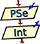
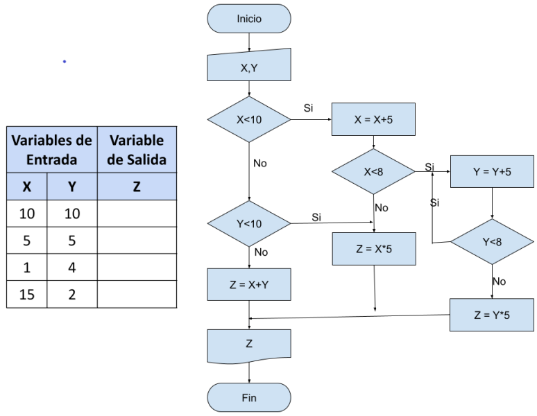
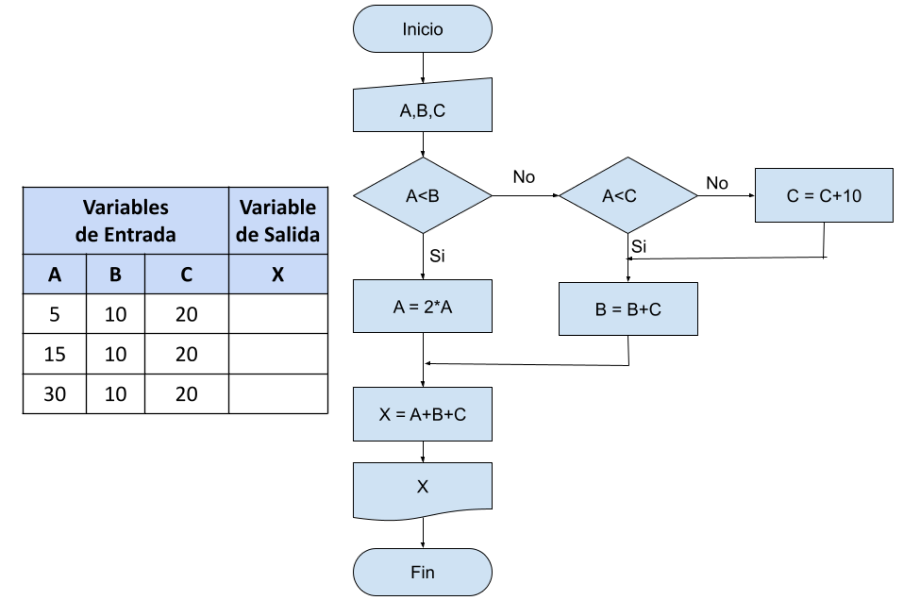
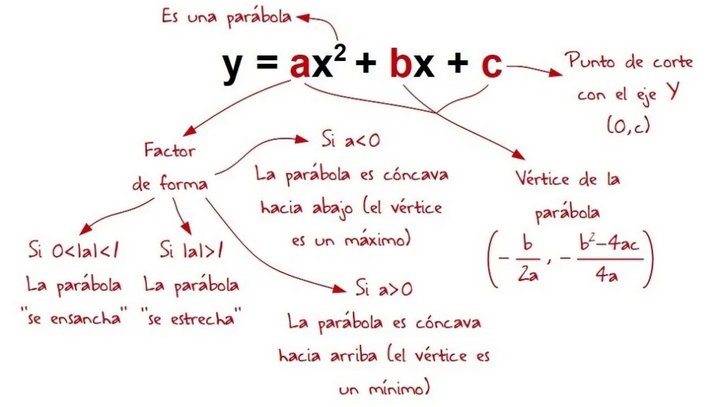
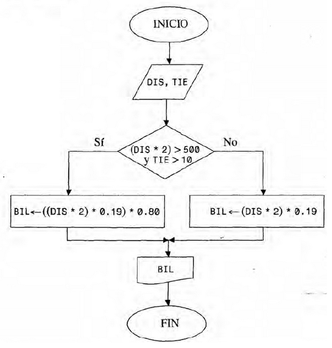
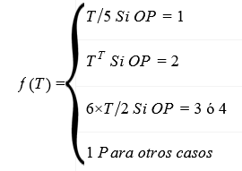
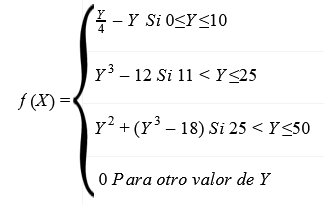

<style>
.reveal section img {
    background: none !important;
    box-shadow: none !important;
    border: none !important;
}
.reveal i.fab {
    font-family:"Font Awesome 5 Brands";
    font-style: normal;
} 

table{
    font-size: 20px;
}

div.grid2{
    display: grid;
    /*grid-template-columns: auto auto auto auto;*/
    grid-template-columns: 25% 25% 25% 25%;
    grid-row-gap: 1ch;
    grid-column-gap: 1ch;
}

div.grid2 div{
    border: white 1px solid;
    font-size: 0.8em;
    background: #9fd1ff;
}

div.grid2 div h3{
    padding: 0;
    margin: 0;
}

div.grid2 div p{
    padding: 0;
    margin: 0;
}

div.grid2 div:hover{
    background: linear-gradient(-45deg, #383bff, #52bfff,#23a6d5,#23d5ab);
    animation: change 4s ease-in-out infinite;
    box-shadow: 5px 7px 12px #5e7280;
}

@keyframes change {
    0%{
        background-position: 0 50%;
    }
    50%{
        background-position: 100% 50%;
    }
    100%{
        background-position: 0 50%;
    }
}
</style>

## TP2: Estructuras Condicionales
Created by [edme88]("https://t.me/edme88")

---
## Ejercicios TP2
#### Ejercicios Introductorios
<!-- .slide: style="font-size: 0.70em" -->
<div class="grid2">
    <div>
        <h3>EJ 1</h3>
        Salida de DF
        <p>
            <a href="#/5"></a>
        </p>
    </div>
    <div>
        <h3>EJ 2</h3>
        Salida de DF
        <p>
            <a href="#/9"></a>
        </p>
    </div>
</div><br>
    
    
#### Estructura de control de alternativa simple
<!-- .slide: style="font-size: 0.70em" -->
<div class="grid2">
    <div>
        <h3>EJ 3</h3>
        Nota aprobada
        <p>
            <a href="#/13"></a>
            <a href="#/17"></a>
        </p>
    </div>
    <div>
        <h3>EJ 4</h3>
        Parque de Diversiones
        <p>
            <a href="#/18"></a>
            <a href="#/20"></a>
            <a href="#/21"></a>
            <a href="#/22"></a>
        </p>
    </div>
    <div>
        <h3>EJ 5</h3>
        R, T, Q
        <p>
            <a href="#/23"></a>
            <a href="#/26"></a>
        </p>
    </div>
    <div>
        <h3>EJ 6</h3>
        Descuento en pago
        <p>
            <a href="#/28"></a>
            <a href="#/31"></a>
            <a href="#/32"></a>
        </p>
    </div>
    <div>
        <h3>EJ 7</h3>
        Intercambio A y B
        <p>
            <a href="#/33"></a>
            <a href="#/35"></a>
            <a href="#/36"></a>
        </p>
    </div>
    <div>
        <h3>EJ 8</h3>
        Aumento de Sueldo
        <p>
            <a href="#/38"></a>
            <a href="#/41"></a>
        </p>
    </div>
</div>

---

## Ejercicio TP2
#### Estructura de control de alternativa doble
<!-- .slide: style="font-size: 0.70em" -->
<div class="grid2">
    <div>
        <h3>EJ 9</h3>
        Aprobado o Desaprobado
        <p>
            <a href="#/43"></a>
            <a href="#/45"></a>
            <a href="#/46"></a>
            <a href="#/47"></a>
        </p>
    </div>
    <div>
        <h3>EJ 10</h3>
        Bancos en Aula
        <p>
            <a href="#/48"></a>
            <a href="#/50"></a>
            <a href="#/51"></a>
        </p>
    </div>
    <div>
        <h3>EJ 11</h3>
        Cuadrado y círculo
        <p>
            <a href="#/53"></a>
            <a href="#/56"></a>
        </p>
    </div>
    <div>
        <h3>EJ 12</h3>
        Función Cuadrática
        <p>
            <a href="#/58"></a>
            <a href="#/60"></a>
            <a href="#/61"></a>
            <a href="#/62"></a>
        </p>
    </div>
    <div>
        <h3>EJ 13</h3>
        Punto (X,Y)
        <p>
            <a href="#/63"></a>
            <a href="#/66"></a>
        </p>
    </div>
    <div>
        <h3>EJ 14</h3>
        Llamada telefónica
        <p>
            <a href="#/68"></a>
        </p>
    </div>
    <div>
        <h3>EJ 15</h3>
        Salario de operario
        <p>
            <a href="#/73"></a>
            <a href="#/76"></a>
        </p>
    </div>
    <div>
        <h3>EJ 16</h3>
        Días de la semana
        <p>
            <a href="#/78"></a>
            <a href="#/81"></a>
            <a href="#/82"></a>
        </p>
    </div>
    <div>
        <h3>EJ 17</h3>
        Salario x categoria
        <p>
            <a href="#/83"></a>
            <a href="#/86"></a>
        </p>
    </div>
    <div>
        <h3>EJ 18</h3>
        Traducir DF
        <p>
            <a href="#/88"></a>
        </p>
    </div>
</div>

---
## Ejercicio TP2
#### Estructura de control de alternativa Múltiple
<!-- .slide: style="font-size: 0.70em" -->
<div class="grid2">
    <div>
        <h3>EJ 19</h3>
        Nombre Mes
        <p>
            <a href="#/93"></a>
            <a href="#/95"></a>
            <a href="#/96"></a>
        </p>
    </div>
    <div>
        <h3>EJ 20</h3>
        Nuevo Sueldo
        <p>
            <a href="#/98"></a>
            <a href="#/101"></a>
        </p>
    </div>
    <div>
        <h3>EJ 21</h3>
        f(T) con T, OP
        <p>
            <a href="#/103"></a>
        </p>
    </div>
    <div>
        <h3>EJ 22</h3>
        f(Y)
        <p>
            <a href="#/108"></a>
        </p>
    </div>
</div>

#### Estructura de control de alternativa en Cascada
<div class="grid2">
    <div>
        <h3>EJ 23</h3>
        + - y 0
        <p>
            <a href="#/114"></a>
            <a href="#/116"></a>
            <a href="#/117"></a>
        </p>
    </div>
    <div>
        <h3>EJ 24</h3>
        Costo Llamada
        <p>
            <a href="#/119"></a>
            <a href="#/121"></a>
        </p>
    </div>
    <div>
        <h3>EJ 25</h3>
        Par o Impar
        <p>
            <a href="#/123"></a>
            <a href="#/126"></a>
        </p>
    </div>
    <div>
        <h3>EJ 26</h3>
        Orden creciente
        <p>
            <a href="#/128"></a>
            <a href="#/131"></a>
        </p>
    </div>
    <div>
        <h3>EJ 27</h3>
        Descuento compra
        <p>
            <a href="#/133"></a>
            <a href="#/136"></a>
        </p>
    </div>
    <div>
        <h3>EJ 28</h3>
        Empleado Sucursal
        <p>
            <a href="#/138"></a>
            <a href="#/141"></a>
        </p>
    </div>
    <div>
        <h3>EJ 29</h3>
        Días y meses
        <p>
            <a href="#/143"></a>
            <a href="#/146"></a>
        </p>
    </div>
</div>

---
## Ejercicio TP2
#### Estructura de control de alternativa EXTRA
<!-- .slide: style="font-size: 0.70em" -->
<div class="grid2">
    <div>
        <h3>EJ 30</h3>
        Arábigos a Romanos
        <p>
            <a href="#/148"></a>
            <a href="#/151"></a>
            <a href="#/152"></a>
        </p>
    </div>
    <div>
        <h3>EJ 31</h3>
        Verificar cuadrante
        <p>
            <a href="#/153"></a>
            <a href="#/156"></a>
        </p>
    </div>
    <div>
        <h3>EJ 32</h3>
        24hs a 12am/pm
        <p>
            <a href="#/158"></a>
        </p>
    </div>
    <div>
        <h3>EJ 33</h3>
        Año Bisiesto
        <p>
            <a href="#/163"></a>
            <a href="#/165"></a>
            <a href="#/166"></a>
        </p>
    </div>
</div>

---
### EJ1: Salida de DF
<!-- .slide: style="font-size: 0.50em" -->
Para el diagrama de flujo determinar la salida en cada uno de los siguientes casos 

<a href="#/1"></a>

---
#### EJ1: Salida de DF
<a href="#/1"></a>

---
#### EJ1: Salida de DF
<a href="#/1"></a>

---
#### EJ1: Salida de DF
<a href="#/1"></a>

---
#### EJ2: Salida de DF
<!-- .slide: style="font-size: 0.50em" -->
Para el diagrama de flujo determinar la salida en cada uno de los siguientes casos 

<a href="#/1"></a>

---
#### EJ2: Salida de DF
<a href="#/1"></a>

---
#### EJ2: Salida de DF
<a href="#/1"></a>

---
#### EJ2: Salida de DF
<a href="#/1"></a>

---
#### EJ3: Nota aprobada
Permite que el usuario ingrese una nota. Si la misma es igual o mayor a 4, debe aparecer el mensaje: “Aprobado”.

<a href="#/1"></a>

---
#### EJ3: Nota aprobada
<a href="#/1"></a>

---
#### EJ3: Nota aprobada
<a href="#/1"></a>

---
#### EJ3: Nota aprobada
````javascript
#include <iostream>
using namespace std;

int main(){
   int Nota;
   cout<<"Ingrese la nota del alumno ";
   cin>>Nota;
   if (Nota>=4){
    cout<<"El alumno esta aprobado"<<endl;
    }
}
````
<a href="#/1"></a>

---
#### EJ3: Nota aprobada
<a href="#/1"></a>

---
#### EJ4: Parque de Diversiones
De acuerdo a la altura de una persona, se le permite entrar a un juego en un parque de diversiones. 
Para poder subirse a la montaña rusa, la persona debe medir 1,30 mts o más, caso contrario no puede.

<a href="#/1"></a>

---
#### EJ4: Parque de Diversiones
<a href="#/1"></a>

---
#### EJ4: Parque de Diversiones
````javascript

````
<a href="#/1"></a>


---
#### EJ4: Parque de Diversiones
````javascript
Algoritmo Unidad2_Ejercicio4
 	Definir altura Como Real
 	Escribir "Ingrese su altura"
 	Leer altura
 	
 	Si altura>=1.3 Entonces
 		Escribir "Puede ingresar a la montaña rusa"
 	SiNo
 		Escribir "Su altura no es suficiente para ingresar al juego"
 	Fin Si
 FinAlgoritmo
````
<a href="#/1"></a>

---
#### EJ4: Parque de Diversiones
<iframe width="560" height="315" src="https://www.youtube.com/embed/4eEfMvFH2fs" title="YouTube video player" frameborder="0" allow="accelerometer; autoplay; clipboard-write; encrypted-media; gyroscope; picture-in-picture" allowfullscreen></iframe>

<a href="#/1"></a>

---
#### EJ5: R, T, Q
Al recibir 3 datos de entrada, R, T y Q calcule si los mismos satisfacen la siguiente expresión:
R^4-T^3+4×Q^2 < 820

<a href="#/1"></a>

---
#### EJ5: R, T, Q
<a href="#/1"></a>

---
#### EJ5: R, T, Q
<a href="#/1"></a>

---
#### EJ5: R, T, Q
````javascript
#include <iostream>
using namespace std;

int main(){
   float  R, T, Q, valor;
   cout<<"Ingrese el valor de R ";
   cin>>R;
   cout<<"Ingrese el valor de T ";
   cin>>T;
   cout<<"Ingrese el valor de Q ";
   cin>>Q;
   valor=R*R*R*R - T*T*T + 4*Q*Q;
   if (valor<820){
    cout<<"Los valores cumplen la expresion"<<endl;
	}
   else{
     cout<<"Los valores no cumplen la expresion"<<endl;
  }
}
````
<a href="#/1"></a>

---
#### EJ5: R, T, Q
<a href="#/1"></a>

---
#### EJ6: Descuento en pago
Permite a un cajero ingresar la forma de pago (efectivo o tarjeta) y el monto a pagar. En caso de haber abonado en 
efectivo, se realizará un descuento del 10%.

<a href="#/1"></a>

---
#### EJ6: Descuento en pago
<a href="#/1"></a>

---
#### EJ6: Descuento en pago
<a href="#/1"></a>

---
#### EJ6: Descuento en pago
````javascript
#include <iostream>
using namespace std;

int main(){
   float  monto;
   char tipoPago;
   cout<<"Ingrese el monto a pagar ";
   cin>>monto;
   cout<<"Ingrese forma de pago (E=efectivo T=tarjeta) ";
   cin>>tipoPago;
   if (tipoPago=='E' || tipoPago=='e'){
    monto=monto-0.1*monto;
   }
  cout<<"El monto a pagar es "<<monto<<endl;
}
````
<a href="#/1"></a>

---
#### EJ6: Descuento en pago
<iframe width="560" height="315" src="https://www.youtube.com/embed/_fSYgHx3hCE" title="YouTube video player" frameborder="0" allow="accelerometer; autoplay; clipboard-write; encrypted-media; gyroscope; picture-in-picture" allowfullscreen></iframe>

<a href="#/1"></a>

---
#### EJ7: Intercambio A y B 
Leer dos números A y B, si A < B intercambiar sus valores de manera tal que en A quede siempre el mayor. 
Mostrar en pantalla el valor de A y B.

<a href="#/1"></a>

---
#### EJ7: Intercambio A y B 
<a href="#/1"></a>

---
#### EJ7: Intercambio A y B 
````javascript
Algoritmo U2_ej7_mayor_menor
	Definir numA, numB, temp Como Real
	
	Escribir "Ingrese numA"
	Leer numA
	Escribir "Ingrese numB"
	Leer numB
	
	Si numA<numB Entonces
		temp=numB
		numB=numA
		numA=temp
	Fin Si
	Escribir "El mayor numero es: ", numA
	Escribir "El menor numero es: ", numB
FinAlgoritmo
````
<a href="#/1"></a>

---
#### EJ7: Intercambio A y B 
````javascript
#include <iostream>
using namespace std;

int main(){
   int A, B, aux;
   cout<<"Ingrese valor de A ";
   cin>>A;
   cout<<"Ingrese valor de B ";
   cin>>B;
   if (A<B){
     aux=B;
     B=A;
     A=aux;
    }
  cout<<"El valor de A es "<<A<<endl;
  cout<<"El valor de B es "<<B<<endl;
}
````
<a href="#/1"></a>

---
#### EJ7: Intercambio A y B 
<a href="#/1"></a>

---
#### EJ8: Aumento de Sueldo
En una empresa se decidió aumentar en un 12% el sueldo de aquellos empleados que cobren menos de $18.000. 
El programa debe permitir ingresar el sueldo del empleado y si corresponde mostrar el mensaje 
“El empleado tiene un aumento. Su nuevo sueldo es:”.

<a href="#/1"></a>

---
#### EJ8: Aumento de Sueldo
<a href="#/1"></a>

---
#### EJ8: Aumento de Sueldo
<a href="#/1"></a>

---
#### EJ8: Aumento de Sueldo
````javascript
#include <iostream>
using namespace std;

int main(){
   float sueldo;
   cout<<"Ingrese sueldo del empleado ";
   cin>>sueldo;
   if (sueldo<18000){
      cout<<"El empleado tiene aumento "<<endl;
      sueldo=sueldo+sueldo*0.12;
      cout<<"El nuevo sueldo es "<<sueldo<<endl;
   }
}
````
<a href="#/1"></a>

---
#### EJ8: Aumento de Sueldo
<a href="#/1"></a>

---
#### EJ9: Aprobado o Desaprobado
Permite que el usuario ingrese una nota. Si la misma es igual o mayor a 4, debe aparecer el mensaje: “Aprobado”. 
Si es inferior a 4 debe aparecer: “Reprobado”.

<a href="#/2"></a>

---
#### EJ9: Aprobado o Desaprobado
<a href="#/2"></a>

---
#### EJ9: Aprobado o Desaprobado
````javascript
Algoritmo unidad2_ej9_nota
	Definir nota Como Real
	Escribir "Ingrese una nota"
	Leer nota
	Si nota>=4 Entonces
		Escribir "Aprobado"
	SiNo
		Escribir "Reprobado"
	Fin Si
FinAlgoritmo
````

<a href="#/2"></a>

---
#### EJ9: Aprobado o Desaprobado
````javascript
#include <iostream>
using namespace std;

int main(){
   int Nota;
   cout<<"Ingrese la nota del alumno ";
   cin>>Nota;
   if (Nota>=4){
    cout<<"El alumno esta aprobado"<<endl;
	}
   else{
    cout<<"El alumno esta reprobado"<<endl;
   }
}
````
<a href="#/2"></a>

---
#### EJ9: Aprobado o Desaprobado
<iframe width="560" height="315" src="https://www.youtube.com/embed/9USwGssxaHU" title="YouTube video player" frameborder="0" allow="accelerometer; autoplay; clipboard-write; encrypted-media; gyroscope; picture-in-picture" allowfullscreen></iframe>

<a href="#/2"></a>

---
#### EJ10: Bancos en Aula
A partir de la cantidad de bancos de un aula y la cantidad de alumnos inscriptos para un curso, permita determinar si 
alcanzan los bancos existentes. De no ser así, informar además cuantos bancos sería necesario agregar. 
El usuario deberá ingresar por teclado tanto la cantidad de bancos que tiene el aula, como la cantidad de alumnos inscriptos para el curso.

<a href="#/2"></a>

---
#### EJ10: Bancos en Aula
<a href="#/2"></a>

---
#### EJ10: Bancos en Aula
````javascript
Algoritmo U2_EJ10_cantBancos
	Definir cantBancos, cantAlumnos Como Entero
	Escribir "Ingrese cantidad de bancos y alumnos"
	Leer cantBancos, cantAlumnos
	
	Si cantBancos>=cantAlumnos Entonces
		Escribir "Alcanzan los bancos"
	SiNo
		Escribir "Faltan ",cantAlumnos-cantBancos, " bancos"
	Fin Si
FinAlgoritmo
````
<a href="#/2"></a>

---
#### EJ10: Bancos en Aula
````javascript
#include <iostream>
using namespace std;

int main(){
   int numBancos, numAlum;
   cout<<"Ingrese la cantidad de alumnos ";
   cin>>numAlum;
   cout<<"Ingrese la cantidad de bancos ";
   cin>>numBancos;
   if (numBancos>=numAlum){
        cout<<"La cantidad de bancos es suficiente"<<endl;
   }
   else{
        cout<<"La cantidad de bancos no es suficiente"<<endl;
        cout<<"Se deben agregar "<<numAlum-numBancos<<" bancos"<<endl;
   }
}
````
<a href="#/2"></a>

---
#### EJ10: Bancos en Aula
<a href="#/2"></a>

---
#### EJ11: Cuadrado y círculo
Leer 2 números A y B. Calcular el área del cuadrado que tiene como lado al mayor de ellos, y el área del círculo que 
tiene como radio al menor de ellos.

<a href="#/2"></a>

---
#### EJ11: Cuadrado y círculo
<a href="#/2"></a>

---
#### EJ11: Cuadrado y círculo
<a href="#/2"></a>

---
#### EJ11: Cuadrado y círculo
````javascript
#include <iostream>
#include <math.h>
using namespace std;

int main(){
   float A,B, areaCuad, areaCirc;
   cout<<"Ingrese el valor de A ";
   cin>>A;
   cout<<"Ingrese el valor de B ";
   cin>>B;
   if (A>=B){
     areaCuad=A*A;
     areaCirc=M_PI*B*B;
   }
   else{
     areaCuad=B*B;
     areaCirc=M_PI*A*A;
   }
   cout<<"El area de cuadrado es "<<areaCuad<<endl;
   cout<<"El area de circulo es "<<areaCirc<<endl;
}
````
<a href="#/2"></a>

---
#### EJ11: Cuadrado y círculo
<a href="#/2"></a>

---
#### EJ12: Función Cuadrática
<!-- .slide: style="font-size: 0.70em" -->
Empleando como base el ejercicio de la unidad anterior (Ejercicio 22): Permite ingresar 3 valores: a, 
b y c. El programa debe mostrar por pantalla el valor de las 2 raíces. 
Recuerde que para la ecuación de segundo grado ax2+bx+c=0 las raíces se calculan a partir de la fórmula x=(-b±raiz(b^2-4ac))/2a
Realice: Modifica tu código para que “analice” la función ¿La parábola se ensancha o se estrecha? 
¿La parábola es cóncava hacia abajo (vértice máximo) o hacia arriba (vértice mínimo)? ¿Cuáles son los puntos de corte 
en el eje Y? ¿Cuál es el vértice de la parábola? ¿Qué tipo de raíces tiene (reales o compleja)?

<a href="#/2"></a>

---
#### EJ12: Función Cuadrática
<a href="#/2"></a>

---
#### EJ12: Función Cuadrática
````javascript
Algoritmo unidad1_ejercicio22_raices
	Definir a, b, c, r1, r2, det, parteReal, parteImg, verticeX, verticeY Como Real
	
	Escribir "Ingrese a, b, c"
	Leer a, b, c
	
	det = b^2 - 4*a*c
	Si det>=0 Entonces
		r1 = (-b + RAIZ(det)) / (2*a)
		r2 = (-b - RAIZ(det)) / (2*a)
		Escribir "Raices Reales"
		Escribir "La raiz R1 es: ", r1
		Escribir "La raiz R2 es: ", r2
	SiNo
		parteReal = (-b/2*a)
		parteImg = RAIZ(-det)/(2*a)
		Escribir "Raices Imaginarias"
		Escribir "La raiz R1 es: ", parteReal, "+", parteImg, "i"
		Escribir "La raiz R2 es: ", parteReal, "-", parteImg, "i"
	Fin Si
	
	Si ABS(a)>1 Entonces
		Escribir "La parábola se ensancha"
	SiNo
		Escribir "La parábola se estrecha"
	Fin Si
	
	Si a<0 Entonces
		Escribir "La parabola tiene un maximo"
	SiNo
		Escribir "La parabola tiene un minimo"
	FinSi
	
	verticeX = (-b)/(2*a)
	verticeY = -det/(4*4)
	Escribir "El vertice X es ", verticeX
	Escribir "El vertice Y es ", verticeY
FinAlgoritmo
````
<a href="#/2"></a>

---
#### EJ12: Función Cuadrática
````javascript
#include <iostream>
#include <math.h>
using namespace std;

int main(){
   float a,b,c, d, x1, x2;
   cout<<"Ingrese el valor de a ";
   cin>>a;
   cout<<"Ingrese el valor de b ";
   cin>>b;
   cout<<"Ingrese el valor de c ";
   cin>>c;
   d=b*b - 4*a*c;
   if (d==0){
     x1=-b/(2*a);
     cout<<"Raices reales dobles : "<<x1<<endl;
   }
   else{
     if (d>0){
     x1=(-b+sqrt(d))/(2*a);
     x2=(-b-sqrt(d))/(2*a);
     cout<<"Raices reales y distintas : "<<x1<<" , "<<x2<<endl;
     }
     else{
       cout<<"Raices complejas conjugadas"<<endl;
     }
   }
}
````
<a href="#/2"></a>

---
#### EJ12: Función Cuadrática
<iframe width="560" height="315" src="https://www.youtube.com/embed/yfITZKFtpfY" title="YouTube video player" frameborder="0" allow="accelerometer; autoplay; clipboard-write; encrypted-media; gyroscope; picture-in-picture" allowfullscreen></iframe>

<a href="#/2"></a>

---
#### EJ13: Punto (X,Y)
Leer un par de datos X e Y, que corresponden a las coordenadas no nulas de un punto plano. 
Determinar en qué cuadrante se encuentra el punto y la distancia al punto de origen.

<a href="#/2"></a>

---
#### EJ13: Punto (X,Y)
<a href="#/2"></a>

---
#### EJ13: Punto (X,Y)
<a href="#/2"></a>

---
#### EJ13: Punto (X,Y)
````javascript
#include <iostream>
#include <math.h>
using namespace std;

int main(){
   float x,y, distancia;
   cout<<"Ingrese el valor de x ";
   cin>>x;
   cout<<"Ingrese el valor de y ";
   cin>>y;
   if (x>0 && y>0){
      cout<<"El punto esta en el primer cuadrante"<<endl;
   }
   else{
     if (x<0 && y>0) {
       cout<<"El punto esta en el segundo cuadrante"<<endl;
     }
     else{
       if (x<0 && y<0){
         cout<<"El punto esta en el tercer cuadrante"<<endl;
       }
       else{
         cout<<"El punto esta en el cuarto cuadrante"<<endl;
       }
     }

   }
   distancia=sqrt(x*x + y*y);
   cout<<"La distancia al origen de coordenadas es "<<distancia;
 }
````
<a href="#/2"></a>

---
#### EJ13: Punto (X,Y)
<a href="#/2"></a>

---
#### EJ14: Llamada telefónica
Determinar el monto total a pagar por una llamada telefónica si se ingresa como dato la duración en minutos de la 
misma teniendo en cuenta:
* Toda llamada menor que 3 minutos tiene un costo de $5
* Cada minuto adicional, tiene un costo de $2,50

<a href="#/2"></a>

---
#### EJ14: Llamada telefónica
<a href="#/2"></a>

---
#### EJ14: Llamada telefónica
<a href="#/2"></a>

---
#### EJ14: Llamada telefónica
<a href="#/2"></a>

---
#### EJ14: Llamada telefónica
<a href="#/2"></a>

---
#### EJ15: Salario de operario
Se desea calcular el salario de un operario, en base a las horas trabajadas quincenalmente
* Si la cantidad de horas <=75, percibe $80/hora
* Si la cantidad de horas>75, percibe 1,5 veces más las horas excedentes.
Del monto calculado se deben realizar los descuentos por aportes e impuestos, con el siguiente criterio:
* Si el monto toral <=3000, dto del 12%
* Si 3000<total<=5000, dto del 20%
* Si total>5000, dto. del 30%

<a href="#/2"></a>

---
#### EJ15: Salario de operario
<a href="#/2"></a>

---
#### EJ15: Salario de operario
<a href="#/2"></a>

---
#### EJ15: Salario de operario
````javascript
#include <iostream>
#include <math.h>

using namespace std;

int main(){
   int horas;
   float sueldoBruto, sueldoNeto;
   cout<<"Ingrese la cantidad de horas trabajadas ";
   cin>>horas;
   if (horas<=75){
     sueldoBruto=horas*80;
   }
   else{
     sueldoBruto=75*80 + (horas-75)*80*1.5;
   }
   cout<<"El sueldo bruto del empleado es "<<sueldoBruto<<endl;
   if (sueldoBruto<=3000){
    sueldoNeto=sueldoBruto-sueldoBruto*0.12;
   }
   else{
    if (sueldoBruto<=5000){
      sueldoNeto=sueldoBruto-sueldoBruto*0.20;
    }
    else{
      sueldoNeto=sueldoBruto-sueldoBruto*0.30;
    }
   }

   cout<<"El sueldo neto del empleado es "<<sueldoNeto<<endl;
 }
````
<a href="#/2"></a>

---
#### EJ15: Salario de operario
<a href="#/2"></a>

---
#### EJ16: Días de la semana
Diseñe un algoritmo que escriba los nombres de los días de la semana en función del valor ingresado por teclado (1 a 7) 
que representa su posición dentro de la semana. (1=Lunes).

<a href="#/2"></a>

---
#### EJ16: Días de la semana
<a href="#/2"></a>

---
#### EJ16: Días de la semana
<a href="#/2"></a>

---
#### EJ16: Días de la semana
````javascript
#include <iostream>
using namespace std;

int main(){
   int nDia;

   cout<<"ingrese el numero de dia de la semana ";
   cin>>nDia;
   switch (nDia) {
     case 1: cout<<"Lunes"<<endl;
             break;
     case 2: cout<<"Martes"<<endl;
             break;
     case 3: cout<<"Miercoles"<<endl;
             break;
     case 4: cout<<"Jueves"<<endl;
             break;
     case 5: cout<<"Viernes"<<endl;
             break;
     case 6: cout<<"Sabado"<<endl;
             break;
     case 7: cout<<"domingo"<<endl;
             break;
     default: cout<<"El numero ingresado no es correcto"<<endl;
   }
}
````
<a href="#/2"></a>

---
#### EJ16: Días de la semana
<iframe width="560" height="315" src="https://www.youtube.com/embed/46483gbna5g" title="YouTube video player" frameborder="0" allow="accelerometer; autoplay; clipboard-write; encrypted-media; gyroscope; picture-in-picture" allowfullscreen></iframe>

<a href="#/2"></a>

---
#### EJ17: Salario x categoría
Se desea calcular el salario neto de un trabajador pidiendo por teclado el legajo, la categoría y la cantidad de horas 
trabajadas. El valor hora depende de la categoría del trabajador y se detalla a continuación en una tabla. Se debe 
realizar un descuento del 20% del salario bruto para todas las categorías.

|Categoría|1 |2 |3 |4 |5 |6 |7 |
| -------:|-:|-:|-:|-:|-:|-:|-:|
|Valor/Hora|$10|$15|$18|$22|$28|$35|$49|


<a href="#/2"></a>

---
#### EJ17: Salario x categoría
<a href="#/2"></a>

---
#### EJ17: Salario x categoría
<a href="#/2"></a>

---
#### EJ17: Salario x categoría
````javascript
#include <iostream>
using namespace std;

int main(){
    int legajo, categoria, cantHoras;
    float sueldoHora, sueldoBruto, sueldoNeto;
    cout<<"Ingrese el legajo del empleado ";
    cin>>legajo;
    cout<<"Ingrese la categoria del empleado ";
    cin>>categoria;
    cout<<"INgrese la cantidad de horas trabajadas ";
    cin>>cantHoras;
    switch (categoria){
         case 1: sueldoHora=10;
                 break;
         case 2: sueldoHora=15;
                 break;
         case 3: sueldoHora=18;
                 break;
         case 4: sueldoHora=22;
                 break;
         case 5: sueldoHora=28;
                 break;
         case 6: sueldoHora=35;
                 break;
         case 7: sueldoHora=49;
                 break;
         default: cout<<"La categoria no es correcta"<< endl;
                  break;
     }
     if (categoria>=1 && categoria <=7)
        {
          sueldoBruto=sueldoHora*cantHoras;
          cout<<"El sueldo bruto del empleado legajo "<<legajo<<" es de "<<sueldoBruto<<endl;
          sueldoNeto=sueldoBruto-sueldoBruto*0.20;
          cout<<"EL sueldo neto del empleado legajo "<<legajo<<" es de "<<sueldoNeto<<endl;
        }
}
````
<a href="#/2"></a>

---
#### EJ17: Salario x categoría
<a href="#/2"></a>

---
#### EJ18: Traducir DF
Traduzca a Pseudocódigo ó C++ el siguiente ejercicio:
Conociendo la distancia entre 2 ciudades y el tiempo de estancia en una ciudad, se puede calcular el precio del pasaje 
de tren. Si la distancia total (ida y vuelta) es mayor a 500 Km y estadía es mayor a 10 días, se obtiene un descuento 
del 20%. El precio por Km recorrido es $0,19.


<a href="#/2"></a>

---
#### EJ18: Traducir DF
<a href="#/2"></a>

---
#### EJ18: Traducir DF
<a href="#/2"></a>

---
#### EJ18: Traducir DF
<a href="#/2"></a>

---
#### EJ18: Traducir DF
<a href="#/2"></a>

---
#### EJ19: Nombre Mes
Diseñar un algoritmo que devuelva el nombre del mes, a partir del número de mes, ingresado por teclado por el usuario.

<a href="#/3"></a>

---
#### EJ19: Nombre Mes
<a href="#/3"></a>

---
#### EJ19: Nombre Mes
````javascript
Algoritmo U2_ej19_meses
	Definir numMes Como Entero
	
	Escribir "Ingrese numero de mes: "
	Leer numMes
	
	Segun numMes Hacer
		1:
			Escribir "Enero"
		2:
			Escribir "Febrero"
		3:
			Escribir "Marzo"
		4:
			Escribir "Abril"
		5:
			Escribir "Mayo"
		6:
			Escribir "Junio"
		7:
			Escribir "Julio"
		8:
			Escribir "Agosto"
		9:
			Escribir "Septiembre"
		10:
			Escribir "Octubre"
		11:
			Escribir "Noviembre"
		12:
			Escribir "Diciembre"
		De Otro Modo:
			Escribir 'El mes ingresado es incorrecto'
	Fin Segun	
FinAlgoritmo
````
<a href="#/3"></a>

---
#### EJ19: Nombre Mes
````javascript
#include <iostream>
using namespace std;

int main(){
    int mes;
    cout<<"Ingrese el numero del mes ";
    cin>>mes;
    switch (mes) {
      case 1: cout<<"Enero"<<endl;
              break;
      case 2: cout<<"Febrero"<<endl;
              break;
      case 3: cout<<"Marzo"<<endl;
              break;
      case 4: cout<<"Abril"<<endl;
              break;
      case 5: cout<<"Mayo"<<endl;
              break;
      case 6: cout<<"Junio"<<endl;
              break;
      case 7: cout<<"Julio"<<endl;
              break;
      case 8: cout<<"Agosto"<<endl;
              break;
      case 9: cout<<"Septiembre"<<endl;
              break;
      case 10: cout<<"Octubre"<<endl;
              break;
      case 11: cout<<"Nobiembre"<<endl;
              break;
      case 12: cout<<"Diciembre"<<endl;
              break;
      default : cout<<"El valor ingresado no es correcto"<<endl;
    }
}
````

<a href="#/3"></a>

---
#### EJ19: Nombre Mes
<a href="#/3"></a>

---
#### EJ20: Nuevo Sueldo
El usuario debe poder ingresar por teclado la categoría y el sueldo de un trabajador. 
El programa debe mostrar por pantalla el nuevo sueldo, sabiendo que según la categoría se brindará los siguientes aumentos:

|Categoría|1 |2 |3 |4 |
| -------:|-:|-:|-:|-:|
|Valor/Hora|15%|10%|8%|7%|

<a href="#/3"></a>

---
#### EJ20: Nuevo Sueldo
<a href="#/3"></a>

---
#### EJ20: Nuevo Sueldo
<a href="#/3"></a>

---
#### EJ20: Nuevo Sueldo
````javascript
#include <iostream>
using namespace std;

int main(){
    int categoria;
    float sueldoActual, aumento, sueldoNuevo;

    cout<<"Ingrese sueldo actual ";
    cin>>sueldoActual;
    cout<<"Ingrese categoria ";
    cin>>categoria;
    switch (categoria){
      case 1: aumento=sueldoActual*0.15;
              break;
      case 2: aumento=sueldoActual*0.10;
              break;
      case 3: aumento=sueldoActual*0.08;
              break;
      case 4: aumento=sueldoActual*0.07;
              break;
      default  : cout<<"La categoria ingresada no es correcta"<<endl;
    }
    if(categoria>=1 && categoria <=4)
    {
      cout<< "El aumento que recibe el empleado es de "<<aumento<<endl;
      sueldoNuevo=sueldoActual + aumento;
      cout<<"El nuevo sueldo es "<<sueldoNuevo<<endl;
     }
 }
````
<a href="#/3"></a>

---
#### EJ20: Nuevo Sueldo
<a href="#/3"></a>

---
#### EJ21: f(T) con T, OP
Recibir como entrada 2 valores: T y OP. Calcule el resultado de la siguiente función: 



<a href="#/3"></a>

---
#### EJ21: f(T) con T, OP 
<a href="#/3"></a>

---
#### EJ21: f(T) con T, OP 
<a href="#/3"></a>

---
#### EJ21: f(T) con T, OP 
<a href="#/3"></a>

---
#### EJ21: f(T) con T, OP 
<a href="#/3"></a>

---
#### EJ22: f(Y)
El usuario ingresa un valor Y. El programa muestra como salida la solución de la ecuación.


<a href="#/3"></a> 

---
#### EJ22: f(Y)
<a href="#/3"></a> 

---
#### EJ22: f(Y)
<a href="#/3"></a> 

---
#### EJ22: f(Y)
<a href="#/3"></a> 

---
#### EJ22: f(Y)
<a href="#/3"></a>

---
#### EJ22: f(Y)
<a href="#/3"></a>

---
#### EJ23: Positivo, Negativo y Cero
Permita leer un número desde el teclado y determinar si es positivo, negativo o cero.

<a href="#/3"></a> 

---
#### EJ23: Positivo, Negativo y Cero
<a href="#/3"></a> 

---
#### EJ23: Positivo, Negativo y Cero
````javascript
Algoritmo U2_Ej23_pos_neg_cero
	Definir numUsuario Como Real
	Escribir "Ingrese un numero"
	Leer numUsuario
	
	Si numUsuario<0 Entonces
		Escribir "El numero es negativo"
	SiNo
		Si numUsuario=0 Entonces
			Escribir "El numero es cero"
		SiNo
			Escribir "El numero es positivo"
		Fin Si
	Fin Si
FinAlgoritmo
````
<a href="#/3"></a> 

---
#### EJ23: Positivo, Negativo y Cero
````javascript
#include <iostream>
using namespace std;

int main(){
	int num;
	cout<<"Ingresar un numero ";
	cin>> num;
	if (num>0){
			cout<<"El numero "<<num<<" es positivo"<<endl;
	}
	else
    {
		if (num==0){
			cout<<"El numero "<<num<<" es igual a cero"<<endl;
		}
		else{
			cout<<"El numero "<<num<<" es negativo"<<endl;
		}
    }
}
````
<a href="#/3"></a> 

---
#### EJ23: Positivo, Negativo y Cero
<a href="#/3"></a> 

---
#### EJ24: Costo Llamada
El costo de las llamadas telefónicas internacionales depende de la zona geográfica en la que se encuentra el país 
destino y el número de minutos hablados.  El usuario debe poder ingresar la clave de la zona y el número de minutos. 
Se debe mostrar por pantalla el monto a abonar por la realización de esa llamada.

| Clave | Zona | Precio |
| -----:| ----:| ------:|
| 12 |América del Norte|2|
| 15 |América Central|2.2|
| 18 |América del Sur|4.5|
| 19 |Europa|3.5|
| 23 |Asia|6|
| 25 |África|6|
| 29 |Oceanía|5|

<a href="#/3"></a> 

---
#### EJ24: Costo Llamada
<a href="#/3"></a> 

---
#### EJ24: Costo Llamada
````javascript
#include <iostream>
using namespace std;

int main(){
	int zona, minutos ;
	float precio;
	cout<<"Ingrese el codigo de zona ";
	cin>>zona;
	cout<<"Ingrese la cantidad de minutos de la llamada ";
	cin>>minutos;
	switch (zona) {
     case 12 : precio=minutos*2;
               break;
     case 15 : precio=minutos*2.2;
               break;
     case 18 : precio=minutos*4.5;
               break;
     case 19 : precio=minutos*3.5;
               break;
     case 23 : precio=minutos*6;
               break;
     case 25 : precio=minutos*6;
               break;
     case 29 : precio=minutos*5;
               break;
     default : cout<<"El codigo de zona es incorrecto"<<endl;
               precio=0;
               break;
	}
	cout<<"El precio de la llamada es de "<<precio<<" pesos"<<endl;
}
````
<a href="#/3"></a> 

---
#### EJ24: Costo Llamada
<a href="#/3"></a> 

---
#### EJ25: Par o Impar
Permita leer un número entero desde el teclado y determinar si es par o impar.

<a href="#/3"></a>

---
#### EJ25: Par o Impar
<a href="#/3"></a> 

---
#### EJ25: Par o Impar
<a href="#/3"></a> 

---
#### EJ25: Par o Impar
````javascript
#include <iostream>
using namespace std;

int main(){
	int Num;
	cout<<"Ingresar el numero ";
	cin>>Num;
	if  (Num % 2 == 0){
		   cout<<"El numero "<<Num<<" es par"<<endl;
        }
		else{
		    cout<<"El numero "<<Num<<" es impar"<<endl;
		}
}
````
<a href="#/3"></a> 

---
#### EJ25: Par o Impar
<a href="#/3"></a>  

---
#### EJ26: Orden creciente
Ingresados 3 números, determine si están en orden creciente o no.

<a href="#/3"></a>

---
#### EJ26: Orden creciente
<a href="#/3"></a> 

---
#### EJ26: Orden creciente
<a href="#/3"></a> 

---
#### EJ26: Orden creciente
````javascript
#include <iostream>
using namespace std;

int main(){
	int num1, num2, num3;
	cout<<"Ingresar el primer numero ";
	cin>>num1;
	cout<<"Ingresar el segundo numero ";
	cin>>num2;
	cout<<"Ingresar el tercer numero ";
	cin>>num3;
	if (num1<num2 && num2<num3)	    {
		cout<<"Los numeros estan en orden creciente"<<endl;
	}
	else{
		cout<<"Los numeros no estan en orden creciente"<<endl;
	}
}
````
<a href="#/3"></a> 

---
#### EJ26: Orden creciente
<a href="#/3"></a>

---
#### EJ27: Descuento compra
En una tienda se realiza un descuento a los clientes dependiendo del monto de la compra.

|Monto |Descuento |
|-----:|---------:|
| Menor a $500 | No hay descuento |
| Entre $500 a $1000 | 5% |
| Entre $1001 a $7000 | 11% |
| Entre $7001 a $15000 | 18% |
| Mayor a $15001 | 25% |

<a href="#/3"></a>

---
#### EJ27: Descuento compra
<a href="#/3"></a> 

---
#### EJ27: Descuento compra
<a href="#/3"></a> 

---
#### EJ27: Descuento compra
````javascript
#include <iostream>
using namespace std;

int main(){
	float Monto, descuento;
	cout<<"Ingrese el monto de la compra";
	cin>>Monto;
	if (Monto>15000){
		descuento=Monto*0.25;
	}
	else{
		if (Monto>7000){
			descuento=Monto*0.18;
		}
		else{
			if (Monto>1000){
				descuento=Monto*0.11;
            }
            else{
				if(Monto>=500){
					descuento=Monto*0.05;
                }
                else{
					descuento=0;
				}
			}
		}
    }
	cout<<"El monto del descuento es "<<descuento<<endl;
	cout<<"El monto a pagar es "<<Monto-descuento<<endl;
}
````
<a href="#/3"></a> 

---
#### EJ27: Descuento compra
<a href="#/3"></a> 

---
#### EJ28: Empleado Sucursal
En una empresa necesitan un empleado para una sucursal. El empleado debe reunir las siguientes condiciones: 
categoría 3 o 4 con antigüedad mayor a 3 años, o bien categoría 2 con antigüedad mayor a 5 años. 
El usuario debe poder ingresar la categoría y la antigüedad, y el programa debe responder si la persona reúne las condiciones para el puesto.  

<a href="#/3"></a>

---
#### EJ28: Empleado Sucursal
<a href="#/3"></a> 

---
#### EJ28: Empleado Sucursal
<a href="#/3"></a> 

---
#### EJ28: Empleado Sucursal
````javascript
#include <iostream>
using namespace std;

int main(){
	int antiguedad, categoria;
	cout<<"Ingresar la categoria del empleado ";
	cin>>categoria;
	cout<<"Ingresar la antiguedad del empleado en años ";
	cin>>antiguedad;
	if (((categoria==3 || categoria==4)&& antiguedad==3) || antiguedad>5)	{
		cout<<"El empleado es apto para el trabajo";
    }
	else{
		cout<<"El empleado no es apto para el trabajo";
    }
}
````
<a href="#/3"></a> 

---
#### EJ28: Empleado Sucursal
<a href="#/3"></a> 

---
#### EJ29: Días y meses
Diseñar un algoritmo que permita el ingreso de 2 variables de tipo numérico entero: Año y Mes. 
Si el valor de mes es de 1,3,5,7,8,10 o 12, se debe asignar a una tercera variable Dia el valor 31; 
si el valor de Mes es 4,6,9 u 11, se le debe asignar el valor 30 y, si el valor de Mes es 2, 
se le debe asignar 28 si el año no es bisiesto y, 29 si lo es.

<a href="#/3"></a> 

---
#### EJ29: Días y meses
<a href="#/3"></a>

---
#### EJ29: Días y meses
<a href="#/3"></a>

---
#### EJ29: Días y meses
````javascript
#include <iostream>
using namespace std;

int main(){
	int mes, anio;
	cout<<"Ingresar el valor del mes ";
	cin>>mes;
	cout<<"Ingresar el valor del anio ";
	cin>>anio;
	if (mes==1 || mes==3 || mes==5 || mes==7 || mes==8 || mes==10 || mes==12){
		cout<<"El mes tiene 31 dias"<<endl;
	}
	else{
      if (mes==4 || mes==6 || mes==9 || mes==11){
			cout<<"El mes tiene 30 dias"<<endl;
      }
      else{
		 if ((anio%4 == 0 && anio%100 !=0) || anio%400 == 0){
				cout<<"El mes tiene 29 dias"<<endl;
		}
		else{
			cout<<"El mes tiene 28 dias"<<endl;
		}
	  }
    }
}
````
<a href="#/3"></a>

---
#### EJ29: Días y meses
<a href="#/3"></a>

---
#### EJ30: Arábigos a Romanos 
Escribir un programa que acepte un año escrito en cifras arábigas y visualice el año escrito en números romanos 
dentro del rango 1000 a 2100. Recuerde que: M=1000, D=500, C=100, L=50, X=10, V=5 y I=1.

<a href="#/4"></a>

---
#### EJ30: Arábigos a Romanos 
<a href="#/4"></a>

---
#### EJ30: Arábigos a Romanos 
<a href="#/4"></a>

---
#### EJ30: Arábigos a Romanos
````javascript
#include <iostream>
using namespace std;

int main()
{
    int anio, un, dec, cen, mil;
    cout<<"Ingrese el valor del anio ";
    cin>>anio;
    un = anio % 10; anio /= 10;
    dec = anio % 10; anio /= 10;
    cen = anio % 10; anio /= 10;
    mil = anio % 10; anio /= 10;
    if ( mil == 1){
      cout << "M";
    }
    else{
      cout << "MM";
    }
    switch (cen){
        case 1: cout << "C"; break;
        case 2: cout << "CC"; break;
        case 3: cout << "CCC"; break;
        case 4: cout << "CD"; break;
        case 5: cout << "D"; break;
        case 6: cout << "DC"; break;
        case 7: cout << "DCC"; break;
        case 8: cout << "DCCC"; break;
        case 9: cout << "CM"; break;
    }
    switch (dec){
        case 1: cout << "X"; break;
        case 2: cout << "XX"; break;
        case 3: cout << "XXX"; break;
        case 4: cout << "XL"; break;
        case 5: cout << "L"; break;
        case 6: cout << "LX"; break;
        case 7: cout << "LXX"; break;
        case 8: cout << "LXXX"; break;
        case 9: cout << "XC"; break;
    }

    switch (un){
        case 1: cout << "I"; break;
        case 2: cout << "II"; break;
        case 3: cout << "III"; break;
        case 4: cout << "IV"; break;
        case 5: cout << "V"; break;
        case 6: cout << "VI"; break;
        case 7: cout << "VII"; break;
        case 8: cout << "VIII"; break;
        case 9: cout << "IX"; break;
    }
}
````
<a href="#/4"></a>

---
#### EJ30: Arábigos a Romanos
<iframe width="560" height="315" src="https://www.youtube.com/embed/qyqxdvlOWuQ" title="YouTube video player" frameborder="0" allow="accelerometer; autoplay; clipboard-write; encrypted-media; gyroscope; picture-in-picture" allowfullscreen></iframe>

<a href="#/4"></a>

---
#### EJ31: Verificar cuadrante
Diseñar un algoritmo que permita determinar si un punto de coordenadas (X,Y), está en un cuadrante ingresado en forma 
de número entero. El programa debe mostrar por pantalla el valor 0 si es falso ó 1 si es verdadero. 
Tanto las coordenadas del punto, como el cuadrante, deben ser leídos desde teclado.

<a href="#/4"></a>

---
#### EJ31: Verificar cuadrante
<a href="#/4"></a>

---
#### EJ31: Verificar cuadrante
<a href="#/4"></a>

---
#### EJ31: Verificar cuadrante
````javascript
#include <iostream>
using namespace std;

int main(){
	float  coorX, coorY;
	int Cuadrante;
	cout<<"Ingrese el valor de la coordenada X ";
	cin>>coorX;
	cout<<"Ingrese el valor de la coordenada Y";
	cin>>coorY;
	cout<<"Ingrese el cuadrante ";
	cin>>Cuadrante;
	if (coorX>0 && coorY>0 && Cuadrante==1){
		  cout<<"1"<<endl;
    }
    else{
 		if (coorX>0 && coorY<0 && Cuadrante==4){
			cout<<"1"<<endl;
		}
		else{
			if (coorX<0 && coorY>0 && Cuadrante==2){
              cout<<"1"<<endl;
            }
            else{
				if (coorX<0 && coorY<0 && Cuadrante==3){
					cout<<"1"<<endl;
                }
                else{
					cout<<"0"<<endl;
                }
		    }
        }
    }
}
````
<a href="#/4"></a>

---
#### EJ31: Verificar cuadrante
<a href="#/4"></a>

---
#### EJ32: 24hs a 12am/pm
Escribir un programa que lea la hora de un día de notación de 24 horas y la respuesta en notación de 12 horas. 
(Ej. 13:45, la salida es 1:45 PM). Le pedirá al usuario que ingrese 5 caracteres de la forma 05:00.
 
<a href="#/4"></a>

---
#### EJ32: 24hs a 12am/pm 
<a href="#/4"></a>

---
#### EJ32: 24hs a 12am/pm 
<a href="#/4"></a>

---
#### EJ32: 24hs a 12am/pm
````javascript

````
<a href="#/4"></a>

---
#### EJ32: 24hs a 12am/pm 
<a href="#/4"></a>

---
#### EJ33: Año Bisiesto
Escribir un programa que determine si un año es bisiesto. Recuerde que un año es bisiesto si es múltiplo de 4 (Ej. 1984). 
Sin embargo, los años múltiplos de 100 sólo son bisiestos cuando a la vez son múltiples de 400 (Ej. 1800 no es bisiesto, pero 2000 si).  

<a href="#/4"></a>

---
#### EJ33: Año Bisiesto 
<a href="#/4"></a>

---
#### EJ33: Año Bisiesto 
````javascript
Algoritmo U2_ej33_bisiesto
	Definir anio Como Entero
	
	Escribir "Ingrese anio"
	Leer anio
	
	Si anio%4==0 Entonces
		Si anio%100==0 Entonces
			Si anio%400==0 Entonces
				Escribir "El año ", anio, " es bisiesto"
			SiNo
				Escribir "El año ", anio, " no es bisiesto"
			Fin Si
		SiNo
			Escribir "El año ", anio, " es bisiesto"
		Fin Si
	SiNo
		Escribir "El año ", anio, " no es bisiesto"
	Fin Si
	
FinAlgoritmo
````
<a href="#/4"></a>

---
#### EJ33: Año Bisiesto
````javascript
#include <iostream>
using namespace std;

int main(){
	int anio;
	cout<< "Ingresar el valor del anio";
	cin>>anio;
	if ((anio%4 == 0 && anio%100!=0) || anio%400 == 0){
		cout<<"El año es bisiesto"<<endl;
	}
    else{
        cout<<"El año no es bisiesto"<<endl;
    }
}
````

<a href="#/4"></a>

---
#### EJ33: Año Bisiesto 
<a href="#/4"></a>