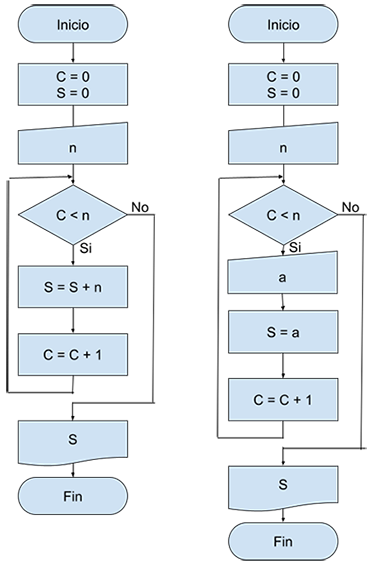
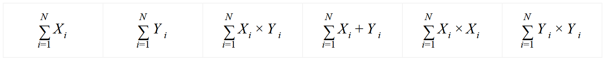
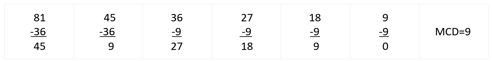
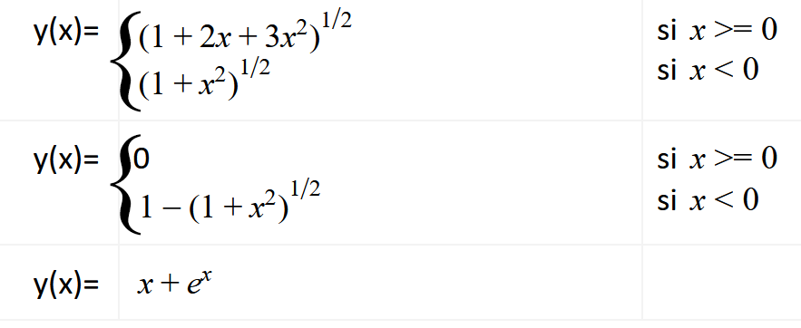

<style>
.reveal section img {
    background: none !important;
    box-shadow: none !important;
    border: none !important;
}
.reveal i.fab {
    font-family:"Font Awesome 5 Brands";
    font-style: normal;
} 

table{
    font-size: 20px;
}

div.grid2{
    display: grid;
    /*grid-template-columns: auto auto auto auto;*/
    grid-template-columns: 25% 25% 25% 25%;
    grid-row-gap: 1ch;
    grid-column-gap: 1ch;
}

div.grid2 div{
    border: white 1px solid;
    font-size: 0.8em;
    background: #9fd1ff;
}

div.grid2 div h3{
    padding: 0;
    margin: 0;
}

div.grid2 div p{
    padding: 0;
    margin: 0;
}

div.grid2 div:hover{
    background: linear-gradient(-45deg, #383bff, #52bfff,#23a6d5,#23d5ab);
    animation: change 4s ease-in-out infinite;
    box-shadow: 5px 7px 12px #5e7280;
}

@keyframes change {
    0%{
        background-position: 0 50%;
    }
    50%{
        background-position: 100% 50%;
    }
    100%{
        background-position: 0 50%;
    }
}
</style>

## TP3: Estructuras Iterativas o Repetitivas
Created by [edme88]("https://t.me/edme88")

---
## Ejercicios TP3
#### Ejercicios Introductorios
<!-- .slide: style="font-size: 0.70em" -->
<div class="grid2">
    <div>
        <h3>EJ 1</h3>
        Suma N números
        <p>
            <a href="#/5"></a>
        </p>
    </div>
</div>
    
#### Estructura de control repetitiva **While**
<!-- .slide: style="font-size: 0.70em" -->
<div class="grid2">
    <div>
        <h3>EJ 2</h3>
        Suma 1 a 10
        <p>
            <a href="#/9"></a>
            <a href="#/12"></a>
        </p>
    </div>
    <div>
        <h3>EJ 3</h3>
        Gastos Viaje
        <p>
            <a href="#/13"></a>
        </p>
    </div>
    <div>
        <h3>EJ 4</h3>
        Promedio Notas
        <p>
            <a href="#/18"></a>
            <a href="#/22"></a>
        </p>
    </div>
    <div>
        <h3>EJ 5</h3>
        Tabla multiplicar
        <p>
            <a href="#/23"></a>
            <a href="#/27"></a>
        </p>
    </div>
</div>

#### Estructura de control repetitiva **Do While**
<div class="grid2">
    <div>
        <h3>EJ 6</h3>
        Suma 1 al 10
        <p>
            <a href="#/28"></a>
        </p>
    </div>
    <div>
        <h3>EJ 7</h3>
        100 pares
        <p>
            <a href="#/33"></a>
            <a href="#/37"></a>
        </p>
    </div>
    <div>
            <h3>EJ 8</h3>
            Unidades Producto
            <p>
                <a href="#/38"></a>
            </p>
        </div>
    <div>
        <h3>EJ 9</h3>
        Aumento de Sueldo
        <p>
            <a href="#/43"></a>
            <a href="#/43"></a>
        </p>
    </div>
</div>

---
## Ejercicio TP3
#### Estructura de control repetitiva **for**
<!-- .slide: style="font-size: 0.70em" -->
<div class="grid2">
    <div>
        <h3>EJ 10</h3>
        Suma 1 a 10
        <p>
            <a href="#/48"></a>
            <a href="#/52"></a>
        </p>
    </div>
    <div>
        <h3>EJ 11</h3>
        Cantidad 0
        <p>
            <a href="#/53"></a>
            <a href="#/56"></a>
            <a href="#/57"></a>
        </p>
    </div>
    <div>
        <h3>EJ 12</h3>
        Mayor y Menor
        <p>
            <a href="#/58"></a>
            <a href="#/61"></a>
            <a href="#/62"></a>
        </p>
    </div>
    <div>
        <h3>EJ 13</h3>
        + - 0
        <p>
            <a href="#/63"></a>
            <a href="#/66"></a>
        </p>
    </div>
    <div>
        <h3>EJ 14</h3>
        Factorial
        <p>
            <a href="#/68"></a>
            <a href="#/72"></a>
        </p>
    </div>
    <div>
        <h3>EJ 15</h3>
        Notas: A, D, P
        <p>
            <a href="#/73"></a>
        </p>
    </div>
    <div>
        <h3>EJ 16</h3>
        Par, Impar, Nulo
        <p>
            <a href="#/78"></a>
        </p>
    </div>
    <div>
        <h3>EJ 17</h3>
        Sueldos
        <p>
            <a href="#/83"></a>
        </p>
    </div>
    <div>
        <h3>EJ 18</h3>
        Primos
        <p>
            <a href="#/88"></a>
            <a href="#/92"></a>
        </p>
    </div>
</div>

---
## Ejercicio TP3
#### Estructura de control repetitiva **EXTRA**
<!-- .slide: style="font-size: 0.70em" -->
<div class="grid2">
    <div>
        <h3>EJ 19</h3>
        Serie 2,5,7,10..
        <p>
            <a href="#/93"></a>
            <a href="#/96"></a>
            <a href="#/97"></a>
        </p>
    </div>
    <div>
        <h3>EJ 20</h3>
        Cant. Ventas
        <p>
            <a href="#/98"></a>
            <a href="#/102"></a>
        </p>
    </div>
    <div>
        <h3>EJ 21</h3>
        Serie 1-1/2+1/3-...
        <p>
            <a href="#/103"></a>
            <a href="#/106"></a>
            <a href="#/107"></a>
        </p>
    </div>
    <div>
        <h3>EJ 22</h3>
        Fibonacci
        <p>
            <a href="#/108"></a>
            <a href="#/112"></a>
            <a href="#/113"></a>
        </p>
    </div>
    <div>
        <h3>EJ 23</h3>
        Conjetura Ulam
        <p>
            <a href="#/114"></a>
            <a href="#/117"></a>
            <a href="#/118"></a>
        </p>
    </div>
    <div>
        <h3>EJ 24</h3>
        Cant. Votos
        <p>
            <a href="#/119"></a>
        </p>
    </div>
    <div>
        <h3>EJ 25</h3>
        Estación metereologica
        <p>
            <a href="#/123"></a>
        </p>
    </div>
    <div>
        <h3>EJ 26</h3>
        Aproximación Pi
        <p>
            <a href="#/128"></a>
            <a href="#/131"></a>
            <a href="#/132"></a>
        </p>
    </div>
    <div>
        <h3>EJ 27</h3>
        Llamada telefonica
        <p>
            <a href="#/133"></a>
            <a href="#/136"></a>
        </p>
    </div>
    <div>
        <h3>EJ 28</h3>
        Pares 2 al 200
        <p>
            <a href="#/138"></a>
        </p>
    </div>
    <div>
        <h3>EJ 29</h3>
        Producto
        <p>
            <a href="#/143"></a>
            <a href="#/147"></a>
        </p>
    </div>
    <div>
        <h3>EJ 30</h3>
        División
        <p>
            <a href="#/148"></a>
        </p>
    </div>
</div>

---
## Ejercicio TP3
#### Estructura de control repetitiva **EXTRA**
<!-- .slide: style="font-size: 0.70em" -->
<div class="grid2">
    <div>
        <h3>EJ 31</h3>
        Potencia
        <p>
            <a href="#/153"></a>
        </p>
    </div>
    <div> 
        <h3>EJ 32</h3>
        Cuadrado Cubo
        <p>
            <a href="#/158"></a>
        </p>
    </div>
    <div>
        <h3>EJ 33</h3>
        Suma-Producto
        <p>
            <a href="#/163"></a>
        </p>
    </div>
    <div>
        <h3>EJ 34</h3>
        Piezas
        <p>
            <a href="#/168"></a>
        </p>
    </div>
    <div>
        <h3>EJ 35</h3>
        10,20,30,40
        <p>
            <a href="#/173"></a>
        </p>
    </div>
    <div>
        <h3>EJ 36</h3>
        A y B
        <p>
            <a href="#/178"></a>
        </p>
    </div>
    <div>
        <h3>EJ 37</h3>
        A, B y C
        <p>
            <a href="#/183"></a>
        </p>
    </div>
    <div>
        <h3>EJ 38</h3>
        N pares X,Y
        <p>
            <a href="#/188"></a>
        </p>
    </div>
    <div>
        <h3>EJ 39</h3>
        MCD
        <p>
            <a href="#/193"></a>
        </p>
    </div>
    <div>
        <h3>EJ 40</h3>
        Funciones
        <p>
            <a href="#/199"></a>
        </p>
    </div>
    <div>
        <h3>EJ 41</h3>
        Max y Min
        <p>
            <a href="#/204"></a>
        </p>
    </div>
    <div>
        <h3>EJ 42</h3>
        Dibujo
        <p>
            <a href="#/208"></a>
        </p>
    </div>
</div>

---
### EJ1: Suma N números 
<!-- .slide: style="font-size: 0.40em" -->
Dada la siguiente consigna: “Calcular la suma de un conjunto de N números leídos desde teclado”, determinar si los 
siguientes diagramas de flujo, resuelven correctamente lo pedido. En caso contrario, indicar los errores:


<a href="#/1"></a>

---
#### EJ1: Suma N números 
<a href="#/1"></a>

---
#### EJ1: Suma N números 
<a href="#/1"></a>

---
#### EJ1: Suma N números 
<a href="#/1"></a>

---
#### EJ2: Suma 1 a 10
Realice la sumatoria de los números enteros comprendidos entre el 1 al 10.

<a href="#/1"></a>

---
#### EJ2: Suma 1 a 10
<a href="#/1"></a>

---
#### EJ2: Suma 1 a 10
<a href="#/1"></a>

---
#### EJ2: Suma 1 a 10
<iframe width="560" height="315" src="https://www.youtube.com/embed/_NfFOFvfX1s" title="YouTube video player" frameborder="0" allow="accelerometer; autoplay; clipboard-write; encrypted-media; gyroscope; picture-in-picture" allowfullscreen></iframe>

<a href="#/1"></a>

---
#### EJ3: Gastos Viaje 
Queremos conocer los gastos de nuestro último viaje. Permita al usuario ingresar todos los gastos deseados. 
El programa mostrará la sumatoria de los mismos cuando el usuario ingrese un valor negativo.

<a href="#/1"></a>

---
#### EJ3: Gastos Viaje 
<a href="#/1"></a>

---
#### EJ3: Gastos Viaje 
<a href="#/1"></a>

---
#### EJ3: Gastos Viaje 
````javascript

````
<a href="#/1"></a>

---
#### EJ3: Gastos Viaje 
<a href="#/1"></a>

---
#### EJ4: Promedio Notas
Permita al usuario ingresar cualquier cantidad de notas. El proceso finalizará cuando se ingrese un ‘0’. Posteriormente, 
calculará el promedio de las notas.

<a href="#/1"></a>

---
#### EJ4: Promedio Notas
<a href="#/1"></a>

---
#### EJ4: Promedio Notas
<a href="#/1"></a>

---
#### EJ4: Promedio Notas
````javascript

````
<a href="#/1"></a>

---
#### EJ4: Promedio Notas
<iframe width="560" height="315" src="https://www.youtube.com/embed/Ex5chcpeTPI" title="YouTube video player" frameborder="0" allow="accelerometer; autoplay; clipboard-write; encrypted-media; gyroscope; picture-in-picture" allowfullscreen></iframe>

<a href="#/1"></a>

---
#### EJ5: Tabla multiplicar 
Muestre por pantalla la tabla de multiplicación del número que ingrese el usuario. Para definir hasta que número desea 
que muestre la tabla de multiplicación el usuario también deberá ingresar este valor. La tabla de multiplicación a 
mostrar debe empezar en la multiplicación por 1.

<a href="#/1"></a>

---
#### EJ5: Tabla multiplicar 
<a href="#/1"></a>

---
#### EJ5: Tabla multiplicar 
<a href="#/1"></a>

---
#### EJ5: Tabla multiplicar 
````javascript

````
<a href="#/1"></a>

---
#### EJ5: Tabla multiplicar 
<iframe width="560" height="315" src="https://www.youtube.com/embed/qsFkt_5gNyQ" title="YouTube video player" frameborder="0" allow="accelerometer; autoplay; clipboard-write; encrypted-media; gyroscope; picture-in-picture" allowfullscreen></iframe>

<a href="#/1"></a>

---
#### EJ6: Suma 1 al 10 
Realice la sumatoria de los números enteros comprendidos entre el 1 al 10.

<a href="#/1"></a>

---
#### EJ6: Suma 1 al 10 
<a href="#/1"></a>

---
#### EJ6: Suma 1 al 10 
<a href="#/1"></a>

---
#### EJ6: Suma 1 al 10 
````javascript
````
<a href="#/1"></a>

---
#### EJ6: Suma 1 al 10 
<a href="#/1"></a>

---
#### EJ7: 100 pares  
Existen 1000 unidades de un determinado producto. Mientras existan más de 200 se pueden seguir realizando entregas. 
Si la cantidad baja de 200 debe notificarse un alerta.


<a href="#/1"></a>

---
#### EJ7: 100 pares 
<a href="#/1"></a>

---
#### EJ7: 100 pares 
<a href="#/1"></a>

---
#### EJ7: 100 pares 
````javascript

````
<a href="#/1"></a>

---
#### EJ7: 100 pares
<iframe width="560" height="315" src="https://www.youtube.com/embed/6xLcHe2ZbEw" title="YouTube video player" frameborder="0" allow="accelerometer; autoplay; clipboard-write; encrypted-media; gyroscope; picture-in-picture" allowfullscreen></iframe>

<a href="#/1"></a>

---
#### EJ8: Aumento de Sueldo
En una empresa se decidió aumentar en un 12% el sueldo de aquellos empleados que cobren menos de $18.000. 
El programa debe permitir ingresar el sueldo del empleado y si corresponde mostrar el mensaje 
“El empleado tiene un aumento. Su nuevo sueldo es:”.

<a href="#/1"></a>

---
#### EJ8: Aumento de Sueldo
<a href="#/1"></a>

---
#### EJ8: Aumento de Sueldo
<a href="#/1"></a>

---
#### EJ8: Aumento de Sueldo
````javascript
````
<a href="#/1"></a>

---
#### EJ8: Aumento de Sueldo
<a href="#/1"></a>

---
#### EJ9: Aumento de Sueldo 
Calcule el aumento de sueldo de para un grupo de empleados teniendo en cuenta el siguiente criterio: Si el sueldo es 
inferior a $18000, aumento de 15%, Si el sueldo es mayor o igual a $18000, aumento del 12%.

<a href="#/1"></a>

---
#### EJ9: Aumento de Sueldo 
<a href="#/1"></a>

---
#### EJ9: Aumento de Sueldo 
<a href="#/1"></a>

---
#### EJ9: Aumento de Sueldo 
````javascript
````
<a href="#/1"></a>

---
#### EJ9: Aumento de Sueldo 
<iframe width="560" height="315" src="https://www.youtube.com/embed/ERNtV-koCGU" title="YouTube video player" frameborder="0" allow="accelerometer; autoplay; clipboard-write; encrypted-media; gyroscope; picture-in-picture" allowfullscreen></iframe>

<a href="#/1"></a>

---
#### EJ10: Suma 1 a 10
Realice la sumatoria de los números enteros comprendidos entre el 1 al 10.

<a href="#/2"></a>

---
#### EJ10: Suma 1 a 10
<a href="#/2"></a>

---
#### EJ10: Suma 1 a 10 
<a href="#/2"></a>

---
#### EJ10: Suma 1 a 10 
````javascript

````
<a href="#/2"></a>

---
#### EJ10: Suma 1 a 10 
<iframe width="560" height="315" src="https://www.youtube.com/embed/ERNtV-koCGU" title="YouTube video player" frameborder="0" allow="accelerometer; autoplay; clipboard-write; encrypted-media; gyroscope; picture-in-picture" allowfullscreen></iframe>

<a href="#/2"></a>

---
#### EJ11: Cantidad 0
Permite ingresar 12 números por teclado. Cuenta la cantidad de veces que se ingresó el cero.

<a href="#/2"></a>

---
#### EJ11: Cantidad 0
<a href="#/2"></a>

---
#### EJ11: Cantidad 0
<a href="#/2"></a>

---
#### EJ11: Cantidad 0
````javascript
#include <iostream>
using namespace std;

int main(){
    int nro, contceros=0, contnum;

    for (contnum=0;contnum<12;contnum++){
        cout<<"Ingrese un numero ";
        cin>>nro;
        if (nro == 0)
         {
           contceros++;
          }
    }
   cout<<"La cantidad de ceros encontrada fue "<<contceros<<endl;
}
````
<a href="#/2"></a>

---
#### EJ11: Cantidad 0
<iframe width="560" height="315" src="https://www.youtube.com/embed/3fFeeWwv0II" title="YouTube video player" frameborder="0" allow="accelerometer; autoplay; clipboard-write; encrypted-media; gyroscope; picture-in-picture" allowfullscreen></iframe>

<a href="#/2"></a>

---
#### EJ12: Mayor y Menor 
Determinar el mayor y el menor entre diez números enteros ingresados por teclado.

<a href="#/2"></a>

---
#### EJ12: Mayor y Menor 
<a href="#/2"></a>

---
#### EJ12: Mayor y Menor 
<a href="#/2"></a>

---
#### EJ12: Mayor y Menor 
````javascript
#include <iostream>
using namespace std;

int main(){
    int nro,cnro, mayor, menor;
    for (cnro=1;cnro<=10;cnro++){
       cout<<"Ingrese un numero ";
       cin>>nro;
       if (cnro==1){
         mayor=nro;
         menor=nro;
       }
       else{
        if (mayor<nro){
            mayor=nro;
        }
        if (menor>nro){
            menor=nro;
        }
       }
     }
     cout<<"El numero mayor de la serie fue "<<mayor<<endl;
     cout<<"EL numero menor de la serie fue "<<menor<<endl;
}
````
<a href="#/2"></a>

---
#### EJ12: Mayor y Menor 
<iframe width="560" height="315" src="https://www.youtube.com/embed/CaPK-XWgTes" title="YouTube video player" frameborder="0" allow="accelerometer; autoplay; clipboard-write; encrypted-media; gyroscope; picture-in-picture" allowfullscreen></iframe>

<a href="#/2"></a>

---
#### EJ13: + - 0 
Leer diez números y determinar la cantidad de ceros, positivos y negativos.

<a href="#/2"></a>

---
#### EJ13: + - 0 
<a href="#/2"></a>

---
#### EJ13: + - 0 
<a href="#/2"></a>

---
#### EJ13: + - 0 
````javascript
#include <iostream>
using namespace std;

int main(){
  int nro,c, contceros=0, contpos=0, contneg=0;

  for(c=1;c<=10;c++){
    cout<<"Ingrese un numero ";
    cin>>nro;
    if (nro>0){
       contpos++;
    }
    else{
      if (nro<0){
        contneg++;
      }
      else{
        contceros++;
      }
     }
  }
  cout<<"La centidad de positivos fue "<<contpos<<endl;
  cout<<"La cantidad de negativos fue "<<contneg<<endl;
  cout<<"La cantidad de ceros fue "<<contceros<<endl;
}
````
<a href="#/2"></a>

---
#### EJ13: + - 0
<a href="#/2"></a>

---
#### EJ14: Factorial 
El programa debe calcular el factorial de un número N que ingrese el usuario.

Ej.      6! = 6 x 5 x 4 x 3 x 2 x 1 = 720


<a href="#/2"></a>

---
#### EJ14: Factorial 
<a href="#/2"></a>

---
#### EJ14: Factorial 
<a href="#/2"></a>

---
#### EJ14: Factorial 
<a href="#/2"></a>

---
#### EJ14: Factorial
<iframe width="560" height="315" src="https://www.youtube.com/embed/2_mZG-lDLHE" title="YouTube video player" frameborder="0" allow="accelerometer; autoplay; clipboard-write; encrypted-media; gyroscope; picture-in-picture" allowfullscreen></iframe>

<a href="#/2"></a>

---
#### EJ15: Notas: A, D, P
Permita ingresar 10 notas por teclado, y que determine si está aprobado (4 o más) o no. Contabilice la cantidad de 
aprobados, la cantidad de desaprobados, y el promedio.

<a href="#/2"></a>

---
#### EJ15: Notas: A, D, P
<a href="#/2"></a>

---
#### EJ15: Notas: A, D, P
<a href="#/2"></a>

---
#### EJ15: Notas: A, D, P
````javascript
````
<a href="#/2"></a>

---
#### EJ15: Notas: A, D, P
<a href="#/2"></a>

---
#### EJ16: Par, Impar, Nulo 
Ingresar 8 números por teclado. Contabilizar la cantidad de pares, impares y nulos.

<a href="#/2"></a>

---
#### EJ16: Par, Impar, Nulo 
<a href="#/2"></a>

---
#### EJ16: Par, Impar, Nulo 
<a href="#/2"></a>

---
#### EJ16: Par, Impar, Nulo 
````javascript
````
<a href="#/2"></a>

---
#### EJ16: Par, Impar, Nulo 

<a href="#/2"></a>

---
#### EJ17: Sueldos
Ingresar la cantidad de trabajadores de la empresa. Posteriormente, ingresar sus sueldos. Calcular el monto que la empresa invierte en sueldos.

<a href="#/2"></a>

---
#### EJ17: Sueldos
<a href="#/2"></a>

---
#### EJ17: Sueldos
<a href="#/2"></a>

---
#### EJ17: Sueldos
````javascript
````
<a href="#/2"></a>

---
#### EJ17: Sueldos
<a href="#/2"></a>

---
#### EJ18: Primos
<!-- .slide: style="font-size: 0.80em" -->
Permite al usuario ingresar un número. Verifica si el número es o no primo. Imprime por pantalla el texto “Es primo” ó “No es Primo.
1. Desarrolle Solución 1: Verificar que solo tiene 2 divisores (1 y sí mismo)
2. Modifique el código de forma tal, que si el número NO es primo, muestre en qué números es divisible.
3. Desarrolle Solución 2: Emplee una bandera que cambie de estado si el número NO es primo.

<a href="#/2"></a>

---
#### EJ18: Primos
<a href="#/2"></a>

---
#### EJ18: Primos
<a href="#/2"></a>

---
#### EJ18: Primos
````javascript
#include <iostream>
using namespace std;
int main(){
    int N,cantdiv=0;
    cout<<"Ingrese el numero que desea comprobar ";
    cin>>N;
    for (int i=2;i<=N/2;i++){
        if (N % i == 0 ){
            cantdiv++;
        }
    }
    if (cantdiv == 0){
        cout<<"El numero "<<N<<" es un numero primo"<<endl;
    }
    else{
        cout<<"El numero "<<N<<" no es un numero primo"<<endl;
    }
}
````

<a href="#/2"></a>

---
#### EJ18: Primos
<iframe width="560" height="315" src="https://www.youtube.com/embed/ZOqTRNTJUY4" title="YouTube video player" frameborder="0" allow="accelerometer; autoplay; clipboard-write; encrypted-media; gyroscope; picture-in-picture" allowfullscreen></iframe>

<a href="#/2"></a>

---
#### EJ19: Serie 2,5,7,10..
El programa debe imprimir los términos de la siguiente serie: 2,5,7,10,12,15,17 (hasta llegar a 100).

<a href="#/3"></a>

---
#### EJ19: Serie 2,5,7,10..
<a href="#/3"></a>

---
#### EJ19: Serie 2,5,7,10..
<a href="#/3"></a>

---
#### EJ19: Serie 2,5,7,10..
````javascript
#include <iostream>
using namespace std;

int main(){
   int Nserie=2,cnum=0;
   cout<<"La serie es : "<<endl;
   while (Nserie<=100){
      cout<<Nserie<<endl;
      cnum++;
      if (cnum % 2 == 0){
         Nserie+=2; //Nserie=Nserie+2;
      }
      else{
         Nserie+=3; //Nserie=Nserie+3;
      }
   }
}
````

<a href="#/3"></a>

---
#### EJ19: Serie 2,5,7,10..
<iframe width="560" height="315" src="https://www.youtube.com/embed/8kBNnqIqRM4" title="YouTube video player" frameborder="0" allow="accelerometer; autoplay; clipboard-write; encrypted-media; gyroscope; picture-in-picture" allowfullscreen></iframe>

<a href="#/3"></a>

---
#### EJ20: Cant. Ventas 
Un vendedor hizo una serie de ventas y desea conocer aquellas de $200 o menos, las mayores a $200 pero inferiores a $400, 
y las de $400 o más. El programa debe permitir ingresar el número de ventas, el monto de cada una. Finalmente, mostrar 
la cantidad de ventas de cada categoría.

<a href="#/3"></a>

---
#### EJ20: Cant. Ventas 
<a href="#/3"></a>

---
#### EJ20: Cant. Ventas 
<a href="#/3"></a>

---
#### EJ20: Cant. Ventas 
````javascript
````
<a href="#/3"></a>

---
#### EJ20: Cant. Ventas 
<iframe width="560" height="315" src="https://www.youtube.com/embed/nq1r4yjSu7Y" title="YouTube video player" frameborder="0" allow="accelerometer; autoplay; clipboard-write; encrypted-media; gyroscope; picture-in-picture" allowfullscreen></iframe>

<a href="#/3"></a>

---
#### EJ21: Serie 1-1/2+1/3-...
El usuario debe poder ingresar un número N, y el programa muestra como salida el resultado de la siguiente serie: 
1-1/2+1/3-1/4+…±1/N

<a href="#/3"></a>

---
#### EJ21: Serie 1-1/2+1/3-...
<a href="#/3"></a>

---
#### EJ21: Serie 1-1/2+1/3-...
<a href="#/3"></a>

---
#### EJ21: Serie 1-1/2+1/3-...
````javascript
#include <iostream>
using namespace std;

int main(){
    float valor=1;
    int N, signo=-1;
    cout<<"ingrese el valor de N ";
    cin>>N;
    for(int den=2;den<=N; den++){
         valor= valor+((1./den)*signo);
         signo=signo*(-1);
    }
    cout<<"El valor de la serie es "<<valor;
}
````

<a href="#/3"></a>

---
#### EJ21: Serie 1-1/2+1/3-...
<iframe width="560" height="315" src="https://www.youtube.com/embed/hHd1RhRAuQM" title="YouTube video player" frameborder="0" allow="accelerometer; autoplay; clipboard-write; encrypted-media; gyroscope; picture-in-picture" allowfullscreen></iframe>

<a href="#/3"></a>

---
#### EJ22: Fibonacci
La sucesión de Fibonacci es una sucesión infinita de números naturales: 0,1,1,2,3,5,8,13… La sucesión comienza con los 
números 0 y 1, y a partir de los mismos, cada término es la suma de los 2 anteriores. El programa debe permitir al 
usuario ingresar la cantidad de números de la sucesión que desea que se muestren (mínimo: 3). Se debe imprimir por 
pantalla la cantidad de números de la sucesión de Fibonacci correspondiente. 

<a href="#/3"></a> 

---
#### EJ22: Fibonacci
<a href="#/3"></a> 

---
#### EJ22: Fibonacci
<a href="#/3"></a> 

---
#### EJ22: Fibonacci
<a href="#/3"></a> 

---
#### EJ22: Fibonacci
````javascript
#include <iostream>
using namespace std;

int main(){
  int ns,ns1,ns2,n;
  do{
  cout<<"Ingrese la cantidad de terminos a mostrar ";
  cin>>n;
  if (n<3){
    cout<<"El valor ingresado debe ser mayor o igual a 3. Ingrese nuevamente"<<endl;
    }
  }
  while (n<3);
  ns1=0;
  ns2=1;
  cout<<ns1<<endl;
  cout<<ns2<<endl;
  for(int i=1;i<=n-2;i++){
    ns=ns1+ns2;
    cout<<ns<<endl;
    ns1=ns2;
    ns2=ns;
  }
}
````

<a href="#/3"></a>

---
#### EJ22: Fibonacci
<iframe width="560" height="315" src="https://www.youtube.com/embed/2ONuxd73Ndk" title="YouTube video player" frameborder="0" allow="accelerometer; autoplay; clipboard-write; encrypted-media; gyroscope; picture-in-picture" allowfullscreen></iframe>

<a href="#/3"></a>

---
#### EJ23: Conjetura Ulam 
Según la “Conjetura de Ulam o Collatz” se puede obtener una serie de números siguiendo las reglas: comenzar por 
cualquier entero positivo. Si es par dividirlo por 2, si es impar multiplicarlo por 3 y agregarle 1. El programa debe 
dejar al usuario introducir un número para comenzar, y debe imprimir por pantalla todos los números de la serie hasta llegar a 1.
Ej: Si num=6, los números son 6, 3, 10, 5, 16, 8, 4, 2, 1

<a href="#/3"></a> 

---
#### EJ23: Conjetura Ulam 
<a href="#/3"></a> 

---
#### EJ23: Conjetura Ulam 
<a href="#/3"></a> 

---
#### EJ23: Conjetura Ulam 
````javascript
#include <iostream>
using namespace std;

int main(){
   int semilla;

   do{
   cout<<"Ingrese la semilla para comenzar ";
   cin>>semilla;
   if (semilla<1){
    cout<<"El valor ingresado no es correcto. Ingrese nuevamente"<<endl;
    }
   }
   while (semilla<1);

   cout<<semilla<<endl;
   while(semilla>1){
    if (semilla%2==0){
        semilla=semilla/2;
    }
    else{
        semilla=semilla*3+1;
    }
    cout<<semilla<<endl;
    }
}
````
<a href="#/3"></a> 

---
#### EJ23: Conjetura Ulam
<iframe width="560" height="315" src="https://www.youtube.com/embed/HxWLLRfFEJw" title="YouTube video player" frameborder="0" allow="accelerometer; autoplay; clipboard-write; encrypted-media; gyroscope; picture-in-picture" allowfullscreen></iframe>

<a href="#/3"></a> 

---
#### EJ24: Cant. Votos
En una elección hubo 4 candidatos (con identificadores 1,2,3 y 4). El programa debe contar el número de votos 
correspondientes a cada uno (y voto en blanco ‘cero’) y el porcentaje que obtuvo respecto al total de votantes. 
El usuario ingresará los votos, indicando con -1 cuando haya terminado.

<a href="#/3"></a> 

---
#### EJ24: Cant. Votos 
<a href="#/3"></a> 

---
#### EJ24: Cant. Votos 
````javascript
````
<a href="#/3"></a> 

---
#### EJ24: Cant. Votos 
<a href="#/3"></a> 

---
#### EJ25: Estación metereologica 
En una estación meteorológica se llevan los registros mensuales de las lluvias de 3 regiones: norte, centro y sur. El 
programa debe permitir ingresar estos datos, calcular el promedio de cada región, y la región con mayor lluvia.

<a href="#/3"></a>

---
#### EJ25: Estación metereologica
<a href="#/3"></a> 

---
#### EJ25: Estación metereologica 
<a href="#/3"></a> 

---
#### EJ25: Estación metereologica 
````javascript
````
<a href="#/3"></a> 

---
#### EJ25: Estación metereologica 
<a href="#/3"></a>  

---
#### EJ26: Aproximación Pi 
Calcular el valor de Pi utilizando la siguiente serie:
Pi=4/1-4/3+4/5-4/7+4/9-…
La diferencia entre la serie y Pi debe ser menor a 0,0005. El programa debe imprimir el número de términos requeridos para obtener esa precisión.

<a href="#/3"></a>

---
#### EJ26: Aproximación Pi 
<a href="#/3"></a> 

---
#### EJ26: Aproximación Pi 
<a href="#/3"></a> 

---
#### EJ26: Aproximación Pi 
````javascript
#include <iostream>
#include <math.h>
using namespace std;

int main(){

  float pi=4,dif=fabs(pi-M_PI);
  int den=3,signo=-1, cvueltas=0;
  while(dif>0.005){
      pi=pi+(4.0/den)*signo;
      signo=signo*(-1);
      den=den+2;
      dif=fabs(pi-M_PI);
      cvueltas++; //cvueltas=cvueltas+1
  }
  cout<<"Valor calculado de pi "<<pi<<endl;
  cout<<"Valor real de pi "<<M_PI<<endl;
  cout<<"Las iteraciones necesarias fueron "<<cvueltas<<endl;
}
````
<a href="#/3"></a> 

---
#### EJ26: Aproximación Pi
<iframe width="560" height="315" src="https://www.youtube.com/embed/w7Pcmcf6wHw" title="YouTube video player" frameborder="0" allow="accelerometer; autoplay; clipboard-write; encrypted-media; gyroscope; picture-in-picture" allowfullscreen></iframe>

<a href="#/3"></a>

---
#### EJ27: Llamada telefonica
<!-- .slide: style="font-size: 0.70em" -->
Para calcular el precio de unas llamadas telefónicas se posee la siguiente información:”
* Internacional
 * 3 primeros minutos $7.59
 * Cada minuto adicional $3.03
* Nacional
 * 3 primeros minutos $1.20
 * Cada minuto adicional $0.48
* Local
 * 50 primeras llamadas, gratis
 * Luego, $0.60 por llamada

El usuario debe ingresar el tipo de llamada y la cantidad de minutos hablados. Si en tipo, se ingresa un valor distinto 
a ‘i’,’n’ ó ‘l’, el programa muestra el costo de todas las llamadas, y un resumen por tipo.

<a href="#/3"></a>

---
#### EJ27: Llamada telefonica
<a href="#/3"></a> 

---
#### EJ27: Llamada telefonica
<a href="#/3"></a> 

---
#### EJ27: Llamada telefonica
````javascript
#include <iostream>
using namespace std;

int main(){
    char tipo;
    int minutos,conllocal=0;
    float costo,costoTotal=0;
    do{
        cout<<"Ingrese i=Internacional, n=Nacional, l=Local o s=Salir ";
        cin>>tipo;
        if (tipo != 's'){
           if (tipo=='i' || tipo=='n'){
             cout<<"Ingrese la cantidad de minutos ";
             cin>>minutos;
             if (tipo=='i'){
               costo=7.59;
               if(minutos>3)
                {
                 costo=costo+(minutos-3)*3.03;
                }
             }
             else{
               costo=1.20;
               if (minutos>3){
                  costo=costo+(minutos-3)*0.48;
                }
             }
            }
            else{
               conllocal++;
               if (conllocal>50){
                   costo=0.60;
               }
               else{
                   costo=0;
               }
            }
        cout<<"Esta llamada cuesta "<<costo<<endl;
        costoTotal=costoTotal+costo;
        }
    }
    while (tipo!='s');
    cout<<"El costo total de llamadas es "<<costoTotal<<endl;
}
````
<a href="#/3"></a> 

---
#### EJ27: Llamada telefonica
<a href="#/3"></a> 

---
#### EJ28: Pares 2 al 200 
Sumar los números pares comprendidos entre 2 y 200.

<a href="#/3"></a>

---
#### EJ28: Pares 2 al 200 
<a href="#/3"></a> 

---
#### EJ28: Pares 2 al 200 
<a href="#/3"></a> 

---
#### EJ28: Pares 2 al 200 
````javascript
````
<a href="#/3"></a> 

---
#### EJ28: Pares 2 al 200
<a href="#/3"></a> 

---
#### EJ29: Producto
Realizar el producto entre dos enteros como sumas sucesivas.

<a href="#/3"></a> 

---
#### EJ29: Producto
<a href="#/3"></a>

---
#### EJ29: Producto
<a href="#/3"></a>

---
#### EJ29: Producto
````javascript
````
<a href="#/3"></a>

---
#### EJ29: Producto
<iframe width="560" height="315" src="https://www.youtube.com/embed/Hgz77Mcfit4" title="YouTube video player" frameborder="0" allow="accelerometer; autoplay; clipboard-write; encrypted-media; gyroscope; picture-in-picture" allowfullscreen></iframe>

<a href="#/3"></a>

---
#### EJ30: División
Realizar la división entre dos enteros como diferencias sucesivas, indicando el cociente y el resto de la división.

<a href="#/3"></a>

---
#### EJ30: División
<a href="#/3"></a>

---
#### EJ30: División
<a href="#/3"></a>

---
#### EJ30: División
````javascript
````
<a href="#/3"></a>

---
#### EJ30: División
<a href="#/3"></a>

---
#### EJ31: Potencia
Realizar la potencia como productos sucesivos.

<a href="#/4"></a>

---
#### EJ31: Potencia
<a href="#/4"></a>

---
#### EJ31: Potencia
<a href="#/4"></a>

---
#### EJ31: Potencia
````javascript
````
<a href="#/4"></a>

---
#### EJ31: Potencia
<a href="#/4"></a>

---
#### EJ32: Cuadrado Cubo 
Calcular el cuadrado y el cubo de una serie de números positivos , ingresando los datos desde una terminal. La serie 
termina cuando se ingresa el número cero.

<a href="#/4"></a>

---
#### EJ32: Cuadrado Cubo 
<a href="#/4"></a>

---
#### EJ32: Cuadrado Cubo 
<a href="#/4"></a>

---
#### EJ32: Cuadrado Cubo 
````javascript

````
<a href="#/4"></a>

---
#### EJ32: Cuadrado Cubo 
<a href="#/4"></a>

---
#### EJ33: Suma-Producto 
Calcular para diez pares de números leídos desde una terminal, la suma y el producto de dichos pares.

<a href="#/4"></a>

---
#### EJ33: Suma-Producto 
<a href="#/4"></a>

---
#### EJ33: Suma-Producto 
<a href="#/4"></a>

---
#### EJ33: Suma-Producto 
````javascript
````

<a href="#/4"></a>

---
#### EJ33: Suma-Producto
<a href="#/4"></a>

---
#### EJ34: Piezas
Se debe realizar el control de calidad en una producción de piezas, si se consideran como aptas todas las piezas que 
miden entre 1,15 y 1,20. Calcular la cantidad de piezas aptas, no aptas, y su porcentaje. El procesa finaliza cuando 
se ingresa una longitud nula.

<a href="#/4"></a>

---
#### EJ34: Piezas
<a href="#/4"></a>

---
#### EJ34: Piezas
<a href="#/4"></a>

---
#### EJ34: Piezas
````javascript
````
<a href="#/4"></a>

---
#### EJ34: Piezas
<a href="#/4"></a>

---
#### EJ35: 10,20,30,40
Se ingresa una serie de números enteros. Determinar cuántas veces se presentan las números 10, 20, 30 y 40 y la 
cantidad de números ingresados distintos de los anteriores. El proceso finaliza cuando se ingresa el número 99.

<a href="#/4"></a>

---
#### EJ35: 10,20,30,40
<a href="#/4"></a>

---
#### EJ35: 10,20,30,40
<a href="#/4"></a>

---
#### EJ35: 10,20,30,40
<a href="#/4"></a>

---
#### EJ35: 10,20,30,40
<a href="#/4"></a>

---
#### EJ36: A y B
Leer un par de valores enteros A y B. Generar e imprimir los números comprendidos entre ellos, la cantidad de números y su sumatoria.
````javascript
Ingresar número A: 3
Ingresar número B: 8
Los números comprendidos entre ellos es:
4
5
6
7
La cantidad de números es: 4
La sumatoria de números es: 22
````

<a href="#/4"></a>

---
#### EJ36: A y B
<a href="#/4"></a>

---
#### EJ36: A y B
<a href="#/4"></a>

---
#### EJ36: A y B
````javascript
````

<a href="#/4"></a>

---
#### EJ36: A y B
<a href="#/4"></a>

---
#### EJ37: A, B y C 
Leer 3 valores enteros distintos A, B y C. Imprimir los números comprendidos entre el menor y el doble del mayor; 
sumándole sucesivamente al menor el restante.

<a href="#/4"></a>

---
#### EJ37: A, B y C
<a href="#/4"></a>

---
#### EJ37: A, B y C
<a href="#/4"></a>

---
#### EJ37: A, B y C
````javascript
````
<a href="#/4"></a>

---
#### EJ37: A, B y C 
<a href="#/4"></a>

---
#### EJ38: N pares X,Y 
Leer N pares de valores X e Y (N ingresado como dato). Calcular cada una de las siguientes expresiones:



<a href="#/4"></a>

---
#### EJ38: N pares X,Y 
<a href="#/4"></a>

---
#### EJ38: N pares X,Y 
<a href="#/4"></a>

---
#### EJ38: N pares X,Y 
<a href="#/4"></a>

---
#### EJ38: N pares X,Y 
<a href="#/4"></a>

---
#### EJ39: MCD
Calcular el máximo común divisor (MCD) entre dos enteros, mediante el algoritmo de Euclides. (El MCD entre dos números 
enteros se lo obtiene restando del mayor el menor y repetir el proceso entre el resultado de la resta y el menos, hasta 
que de cero siendo el MCD el último resultado). Ej. El MCD entre 81 y 36 será:



<a href="#/4"></a> 

---
#### EJ39: MCD
<a href="#/4"></a> 

---
#### EJ39: MCD
<a href="#/4"></a> 

---
#### EJ39: MCD
<a href="#/4"></a> 

---
#### EJ39: MCD
<a href="#/4"></a>

---
#### EJ39: MCD
<a href="#/4"></a>

---
#### EJ40: Funciones 
Escribir un algoritmo que permita tabular las siguientes funciones, para -5<=x<=5y un incremento de 0,5:



<a href="#/4"></a> 

---
#### EJ40: Funciones
<a href="#/4"></a> 

---
#### EJ40: Funciones
<a href="#/4"></a> 

---
#### EJ40: Funciones
````javascript
````
<a href="#/4"></a> 

---
#### EJ40: Funciones
<a href="#/4"></a> 

---
#### EJ41: Max y Min 
Diseñar un algoritmo que permita calcular los valores máximos y mínimos relativos a un intervalo dado, 
en cada uno de los siguientes casos:

y(x)=x+cos(x)
y(x)=3x^2-x^3
y(x)=x sen(x)

El programa debe leer los extremos del intervalo y la cantidad de partes en que se dividirá al intervalo para valuar la función.

<a href="#/4"></a> 

---
#### EJ41: Max y Min 
<a href="#/4"></a> 

---
#### EJ41: Max y Min  
````javascript
````
<a href="#/4"></a> 

---
#### EJ41: Max y Min 
<a href="#/4"></a> 

---
#### EJ42: Dibujo
Genere el siguiente dibujo:
````javascript
**********
*********
********
*******
******
*****
****
***
**
*
````

<a href="#/4"></a>

---
#### EJ42: Dibujo
<a href="#/4"></a> 

---
#### EJ42: Dibujo
<a href="#/4"></a> 

---
#### EJ42: Dibujo
````javascript
````
<a href="#/4"></a> 

---
#### EJ42: Dibujo
<a href="#/4"></a>  
