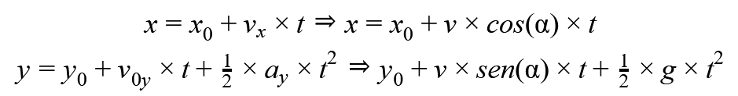
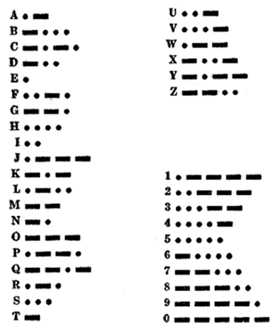
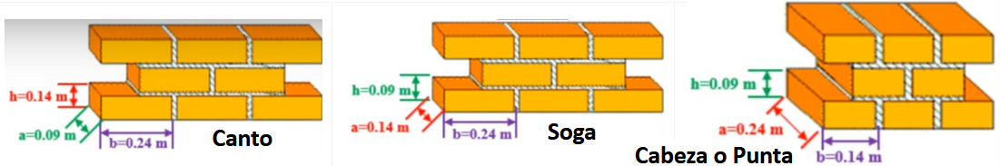
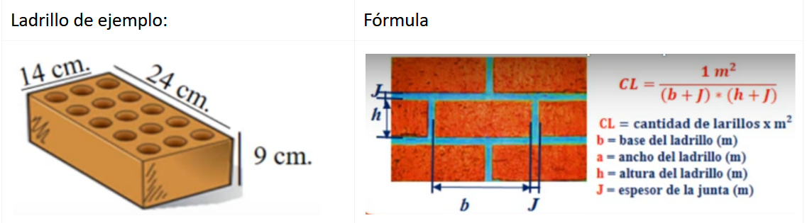

<style>
.reveal section img {
    background: none !important;
    box-shadow: none !important;
    border: none !important;
}
.reveal i.fab {
    font-family:"Font Awesome 5 Brands";
    font-style: normal;
} 

table{
    font-size: 20px;
}

div.grid2{
    display: grid;
    /*grid-template-columns: auto auto auto auto;*/
    grid-template-columns: 25% 25% 25% 25%;
    grid-row-gap: 1ch;
    grid-column-gap: 1ch;
}

div.grid2 div{
    border: white 1px solid;
    font-size: 0.8em;
    background: #9fd1ff;
}

div.grid2 div h3{
    padding: 0;
    margin: 0;
}

div.grid2 div p{
    padding: 0;
    margin: 0;
}

div.grid2 div:hover{
    background: linear-gradient(-45deg, #383bff, #52bfff,#23a6d5,#23d5ab);
    animation: change 4s ease-in-out infinite;
    box-shadow: 5px 7px 12px #5e7280;
}

@keyframes change {
    0%{
        background-position: 0 50%;
    }
    50%{
        background-position: 100% 50%;
    }
    100%{
        background-position: 0 50%;
    }
}
</style>

## TP5: Programación Modular
Created by <i class="fab fa-telegram"></i>
[edme88]("https://t.me/edme88")


---
## Ejercicio TP5
<!-- .slide: style="font-size: 0.70em" -->
<div class="grid2">
    <div>
        <h3>EJ 1</h3>
        N° al Cuadrado
        <p>
            <a href="#/3"></a>
        </p>
    </div>
    <div>
        <h3>EJ 2</h3>
        Suma de N°
        <p>
            <a href="#/8"></a>
        </p>
    </div>
    <div>
        <h3>EJ 3</h3>
        N° mayor
        <p>
            <a href="#/13"></a>
        </p>
    </div>
    <div>
        <h3>EJ 4</h3>
        + - 0
        <p>
            <a href="#/18"></a>
        </p>
    </div>
    <div>
        <h3>EJ 5</h3>
        División exacta
        <p>
            <a href="#/23"></a>
        </p>
    </div>
    <div>
        <h3>EJ 6</h3>
        Vocal
        <p>
            <a href="#/28"></a>
        </p>
    </div>
    <div>
        <h3>EJ 7</h3>
        Trayectoria proyectil
        <p>
            <a href="#/33"></a>
        </p>
    </div>
    <div>
        <h3>EJ 8</h3>
        N° primo
        <p>
            <a href="#/38"></a>
        </p>
    </div>
    <div>
        <h3>EJ 9</h3>
        Conversión N°
        <p>
            <a href="#/43"></a>
        </p>
    </div>
    <div>
        <h3>EJ 10</h3>
        Polar ^ Cartesiano
        <p>
            <a href="#/48"></a>
        </p>
    </div>
    <div>
        <h3>EJ 11</h3>
        Factorial
        <p>
            <a href="#/53"></a>
        </p>
    </div>
    <div>
        <h3>EJ 12</h3>
        Serie a^0,a^1,a^2,...,a^n
        <p>
            <a href="#/58"></a>
        </p>
    </div>
</div>

---
## Ejercicio TP5
<!-- .slide: style="font-size: 0.70em" -->
<div class="grid2">
    <div>
        <h3>EJ 13</h3>
        Área: C, c, R, T
        <p>
            <a href="#/63"></a>
        </p>
    </div>
    <div>
        <h3>EJ 14</h3>
        Código Morse
        <p>
            <a href="#/68"></a>
        </p>
    </div>
    <div>
        <h3>EJ 15</h3>
        Pared
        <p>
            <a href="#/73"></a>
        </p>
    </div>
    
---
### EJ1: N° al Cuadrado
Escriba una función que reciba de parámetro un número entero, y devuelva el cuadrado del mismo.

<a href="#/1"></a>

---
#### EJ1: N° al Cuadrado
<a href="#/1"></a>

---
## EJ1: N° al Cuadrado
````javascript
````

<a href="#/1"></a>

---
## EJ1: N° al Cuadrado
````javascript
````

<a href="#/1"></a>

---
## EJ1: N° al Cuadrado

<a href="#/1"></a>

---
### EJ2: Suma de N° 
Escriba una función que reciba como parámetros 2 números, y retorne la suma de ambos.

<a href="#/1"></a>

---
### EJ2: Suma de N° 

---
### EJ2: Suma de N° 
````javascript
````

<a href="#/1"></a>

---
### EJ2: Suma de N° 
````javascript
````

<a href="#/1"></a>

---
### EJ2: Suma de N° 

---
### EJ3: N° mayor
La función debe recibir como parámetro 2 números, y debe devolver como resultado el mayor de ellos.

<a href="#/1"></a>

---
### EJ3: N° mayor 

---
### EJ3: N° mayor 
````javascript
````

<a href="#/1"></a>

---
### EJ3: N° mayor 
````javascript
````

<a href="#/1"></a>

---
### EJ3: N° mayor 

---
### EJ4: + - 0 
Escriba una función que  tenga un argumento de tipo entero, y que devuelva la letra P, si es positivo, N si es negativo y C si es cero.

<a href="#/1"></a>

---
### EJ4: + - 0 

<a href="#/1"></a>

---
### EJ4: + - 0 
````javascript
````

<a href="#/1"></a>

---
### EJ4: + - 0 
````javascript
````

<a href="#/1"></a>

---
### EJ4: + - 0 

---
### EJ5: División exacta 
Escriba una función que reciba de argumento 2 números enteros, y devuelva true si la división es exacta, o false si no lo es.

<a href="#/1"></a>

---
### EJ5: División exacta 

---
### EJ5: División exacta 
````javascript
````

<a href="#/1"></a>

---
### EJ5: División exacta 
````javascript
````

<a href="#/1"></a>

---
### EJ5: División exacta 

<a href="#/1"></a>

---
### EJ6: Vocal
Escriba una función lógica Vocal, que determine si un carácter es una vocal.

<a href="#/1"></a>

---
### EJ6: Vocal

---
### EJ6: Vocal
````javascript 
````

<a href="#/1"></a>

---
### EJ6: Vocal
````javascript
````

<a href="#/1"></a>

---
### EJ6: Vocal

---
### EJ7: Trayectoria proyectil  
Escribir una función para calcular las coordenadas x e y de la trayectoria de un proyectil de acuerdo a los parámetros 
ángulo de inclinación alfa y la velocidad inicial v a intervalos de 0,1s.


Nota: Tener en cuenta que el proyectil volará hasta tocar el suelo, es decir, cuando y=0.


<a href="#/1"></a>

---
### EJ7: Trayectoria proyectil  

---
### EJ7: Trayectoria proyectil  
````javascript
````

<a href="#/1"></a>

---
### EJ7: Trayectoria proyectil 
````javascript
````

<a href="#/1"></a>

---
### EJ7: Trayectoria proyectil  

---
### EJ8: N° primo
La función debe recibir como parámetro un número, y retornar si es primo o no. Recuerde que un número primo solo es 
divisible en 1 y en sí mismo.
* Modifique el programa anterior para obtener de salida los 10 primeros números primos.

<a href="#/1"></a>

---
### EJ8: N° primo

---
### EJ8: N° primo
````javascript
````

<a href="#/1"></a>

---
### EJ8: N° primo
````javascript
````

<a href="#/1"></a>

---
### EJ8: N° primo

---
### EJ9: Conversión N° 
La función debe recibir como parámetros un número y la unidad. Debe ser capaz de convertir Kilómetros a millas, metros a 
yardas, metros a pies, centímetros a pulgadas, litros a galones y celcius a farenheit. Debe imprimir por pantalla el 
resultado de esta conversión.

|Conervsion|          |
|----------|----------|
|1 kilometro|0.621371 millas|
|1 metro|1.09361 yardas|
|1 metro|3.28084 pies|
|1 centimetro|0.393701 pulgada|
|1 litro|0.264172 galones|

<a href="#/1"></a>

---
### EJ9: Conversión N° 

---
### EJ9: Conversión N° 
````javascript
````

<a href="#/1"></a>

---
### EJ9: Conversión N° 
````javascript
````

<a href="#/1"></a>

---
### EJ9: Conversión N° 

---
### EJ10: Polar ^ Cartesiano 
Escriba un programa que permita al usuario elegir entre 2 opciones. Deben existir 3 funciones: menu, 
convertir_polar_cartesiano, convertir_cartesiano_polar.
* Convertir de coordenadas de polares a cartesianas. Recuerde que x=r×cos(θ) y y=r×sen(θ)
* Convertir de coordenadas de cartesianas a polares. Recuerde que r=raiz(x^2+y^2) y =atan(y/x)

<a href="#/1"></a>

---
### EJ10: Polar ^ Cartesiano 

---
### EJ10: Polar ^ Cartesiano 
````javascript
````

<a href="#/1"></a>

---
### EJ10: Polar ^ Cartesiano 
````javascript
````

<a href="#/1"></a>

---
### EJ10: Polar ^ Cartesiano 

---
### EJ11: Factorial
La función debe recibir como parámetro un número ‘n’, y debe imprimir por pantalla el factorial de ese número. 
Recuerde que por ejemplo 5!=1x2x3x4x5=120.

<a href="#/1"></a>

---
### EJ11: Factorial

---
### EJ11: Factorial
````javascript
````

<a href="#/1"></a>

---
### EJ11: Factorial
````javascript
````

<a href="#/1"></a>

---
### EJ11: Factorial

---
### EJ12: Serie a^0,a^1,a^2,...,a^n  
La función debe recibir como entrada un número ‘a’ y un número ‘n’, y debe mostrar por pantalla: a^0,a^1,a^2,...,a^n  


<a href="#/1"></a>

---
### EJ12: Serie a^0,a^1,a^2,...,a^n  

---
### EJ12: Serie a^0,a^1,a^2,...,a^n  
````javascript
````

<a href="#/1"></a>

---
### EJ12: Serie a^0,a^1,a^2,...,a^n  
````javascript
````

<a href="#/1"></a>

---
### EJ12: Serie a^0,a^1,a^2,...,a^n  

---
### EJ13: Área: C, c, R, T
Escribir un programa que permita al usuario elegir el cálculo del área de cualquiera de las figuras geométricas: 
círculo, cuadrado, rectángulo o triángulo mediante funciones.

<a href="#/2"></a>

---
### EJ13: Área: C, c, R, T

---
### EJ13: Área: C, c, R, T
````javascript
````

<a href="#/2"></a>

---
### EJ13: Área: C, c, R, T
````javascript
````

<a href="#/2"></a>

---
### EJ13: Área: C, c, R, T

---
### EJ14: Código Morse
Escribir un programa que traduzca un texto a código morse:

 <a href="#/2"></a>

---
### EJ14: Código Morse 

---
### EJ14: Código Morse 
````javascript
````

<a href="#/2"></a>

---
### EJ14: Código Morse 
````javascript
````

<a href="#/2"></a>

---
### EJ14: Código Morse 

---
### EJ15: Pared
<!-- .slide: style="font-size: 0.70em" -->
Escribir un programa que permita al usuario ingresar el tipo de aparejo, espesor de la junta y largo y ancho de la 
pared a construir. Debe dar como salida la cantidad de ladrillos necesarios para construir una pared de esas dimensiones. 
Tener en cuenta:
 

<a href="#/2"></a>

---
### EJ15: Pared

---
### EJ15: Pared
````javascript
````

<a href="#/2"></a>

---
### EJ15: Pared
````javascript
````

<a href="#/2"></a>

---
### EJ15: Pared

<a href="#/2"></a>

---
### EJ22: Cálculo de Raíces 


